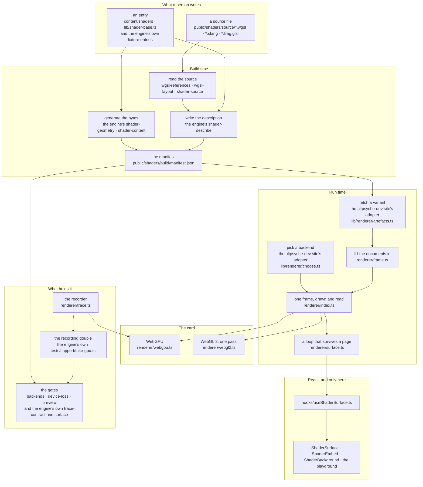

# The abstraction, as it stands and as it would grow

**The `Dnnn` numbers in this file are entries in the decision archive of the `altpsyche-dev` repository, which is private.** They are kept as the address of an entry, and each one says here what it settled, so nothing in this document depends on following a link out of it.

**What this document is.** A map of the layers the shader stack is made of, what each one owns, and where new capability attaches without disturbing the layers around it. It exists so a direction can be read and argued with in one place instead of being inferred from nine files.

**What it is not.** It is not the type surface, which is [RENDERER-DESIGN.md](RENDERER-DESIGN.md), and it is not a plan. Nothing here queues work. Anything this document says is worth doing has to earn a roadmap entry like everything else.

**The decision above it.** D86 says the renderer stays a device layer until an episode needs a scene rather than a frame, that code stays 1:1 with the shader page permanently, and that an engine layer, if one is ever built, is written so that one fact has one home and a reader is told it exists. This document is what that decision looks like drawn out.

## The stack today

The diagram is Mermaid, which GitHub renders in place and an editor renders with its Markdown preview. Nothing here depends on it: the paragraph under it says the same thing in words, and the layer sections say it in detail.

Read it as four crossings rather than nine boxes. A person writes a file and an entry. The build turns those into a description plus whatever bytes no source file can hold. The runtime fetches that description and hands it to one of two backends. React appears in exactly one file below the components, which is the hook.

## What each layer owns

**A source file is the whole shader and the build adds nothing to it.** That is D55, which also says nothing is injected into a source and a constant is declared in the source that uses it. A desktop artefact is byte identical to the file a reader opens in the playground. The only edit the build may make is rewriting a value on a declaration the source already carries, and only for the two reduced phone rungs.

**An entry says the seven things a source cannot say about itself.** How big each resource is, which pipeline runs at what dispatch, which resource is the picture, which picture the build writes into a texture the shader samples, how the card reads that texture at its edges, which two textures trade places every frame, and which primitive the build generates the vertices of. Everything else is read out of the source: its bindings, the format of every texture it writes, the block size a compute entry point runs in, and whether a pass dispatches or draws.

**The build writes a description per target, not per shader.** A description written in GLSL is two documents and a pipeline whose vertex stage is the shader's own. A description written in WGSL is one document and a pipeline asking for the backend's three corners. Only the resources and the passes coincide, which is why the split is by target.

**The runtime reads that description and never invents one.** `artefacts.ts` asks the manifest which files a variant is, `frame.ts` fills the documents in, and the result is a `ShaderFrame`. The gates that matter fill in the build's own description for the same reason: a gate assembling a description of its own is a gate measuring its own idea of one.

**A backend receives a description and has no capability methods.** The rule at the top of `renderer/types.ts` is that a method one backend has to throw from is the wrong method. A backend that grew `createComputePipeline` and `createSampler` would be a backend where WebGL 2 throws from most of its own interface, and a caller asking whether its backend has compute is a caller branching on which backend it holds. What a backend cannot build it never receives, because the manifest is the only thing deciding which backend a shader can be drawn by.

**There are two runtime interfaces and the live one is built on the one shot one.** A build script wants one frame drawn and handed back as pixels. A page wants something that runs until it is stopped and copes with resizing, pixel density, going offscreen and the card being taken away. Handing a build script the live lifecycle gives it state it has to ignore, which is how a script ends up half driving a loop it never wanted.

**No React below the hook.** Four files used to make their own graphics context because the renderer lived inside a component, and one of them never injected the values the others did. That is why the boundary is where it is.

## One fact, one home

This is the part that decides whether the abstraction stays understandable as it grows, so it is written as a ledger rather than as a claim.

| the fact                                 | its one home                                         | why not anywhere else                                                             |
| ---------------------------------------- | ---------------------------------------------------- | --------------------------------------------------------------------------------- |
| what a shader draws                      | the source file                                      | it is what a reader opens, and an article prints it line for line                 |
| which language a shader is written in    | its entry                                            | the source path follows from it, so a stray file is a named error not a silence   |
| how big a resource is                    | its entry                                            | a type in a source may be an array with no length at all                          |
| whether a shader may write a buffer      | the source declaration                               | it is the declaration's own access, and no entry could know it                    |
| the format of a texture a shader writes  | the source declaration                               | a storage declaration carries it, so an entry repeating it could disagree         |
| the format of a texture a shader samples | the entry, through the generator                     | a sampled declaration carries no format, and the bytes and format are one answer  |
| every number about generated geometry    | `lib/shader-geometry.ts`                             | it wrote the bytes, so a stride written elsewhere could contradict them           |
| where each uniform sits in the block     | `lib/wgsl-layout.ts`, held to what Slang emits       | nothing here compiles WGSL, so this is the only layout with no compiler behind it |
| which bindings a pipeline may name       | `lib/wgsl-references.ts`, off the entry point's body | one short and the driver refuses the pipeline; one over and it lies about a stage |
| the value a stencil is marked with       | the mode in the backend                              | a number beside the mode could disagree with the mode                             |
| how many answers a query resolves        | the backend                                          | nothing about it is a choice a source or an entry could make                      |
| which files a variant is                 | the manifest                                         | two halves of the site cannot then disagree about where a shader lives            |

Every disagreement between two of those stops the build rather than reaching the card, because each of them is silent there.

## What holds it, and it is the part worth protecting

The fast suite drives the backend against a stand in for a graphics card that records every call. The trace contract wraps a real device in that same recorder, draws the same artefact, and compares the two traces call for call. Twelve presets agree today. Each capability also has a preset in the corpus that no page publishes and every relevant gate draws, so a trace saying the right calls were made is joined by a frame saying a picture came out.

**This works because the renderer is small.** Each new layer multiplies the states a gate has to cover, and the first property lost is the useful one: that a red gate names the call that went wrong rather than telling you the picture moved.

## How it matures

Three stages. Each names its trigger, what it costs and, more importantly, what it does not change.

### Stage one, which is available now and needs no new layer

Two capabilities are already deferred rather than refused, and either can land the way every capability from step 5 to step 18 landed: one step, one preset, one gate.

**Per draw data.** Today a frame has one uniform block, laid out from the shader's own struct. A second block, or one block read at a different offset per draw, is what lets many objects share a pipeline while each carries its own transform. The design document already names this as deferred until a preset needs it.

**Updating a buffer while the page runs.** There are three write paths today: geometry bytes when the program is made, texture contents when the program is made, and the uniform block once per draw. Nothing can hand new bytes to an existing buffer. That single addition is what a mesh loaded after the page opened needs, and what a simulation whose state is decided on the CPU needs.

Neither of those is a layer. Both are the current abstraction doing its job.

### Stage two, which is a producer rather than a layer

**Trigger:** something wants to decide what a frame is while the page runs, rather than at build time. An episode with a control that adds and removes objects would want this.

A description is data. `FrameDescription` is a plain record of resources, documents, pipelines and passes, and the build is only one producer of it. Two gates and several probes already build one by hand and draw it. So a runtime producer can sit beside the build without the backend knowing which one it was handed.

**What it costs.** Today `createProgram` builds every resource up front and `draw` replays a fixed list of passes. A description that changes per frame means separating what is made once from what is decided every frame. That is the one real piece of surgery in this whole document, and everything in stage three depends on it.

**What it does not change.** The source files, the entries, the manifest, both backends, the recorder, the gates, and every published shader.

### Stage three, which is the engine layer and is gated on content

**Trigger, named in D86:** an episode that needs a scene rather than a frame. Several objects each with a transform, a camera, culling, or an asset loaded at run time. The trigger is deliberately a lesson rather than an itch.

**What it would be.** A producer, in the stage two sense, that turns a scene into a description. Objects with transforms, a camera that becomes a matrix in the uniform block, visibility deciding which draws reach the list. Nothing about it needs a method on the backend, which is the whole reason the earlier stages are worth doing in that order.

**How it would be built, so it does not eat the two things that matter.** The minimal version is built inside the episode's own preset, where a reader watches it being built, and only what a second episode also needs moves into `renderer/`. That keeps code 1:1 with a file a reader can open, and it keeps the abstraction the subject of the writing rather than a thing hidden under it.

**What it would still not be.** Materials, lights, shadow maps, skeletal animation, batching, a post processing stack, physics or an asset pipeline. Each is a project in its own right, and none is on any list here.

## The five invariants any maturation has to survive

1. **Code is 1:1 with the shader page**, in the language that shader is written in. This is permanent under D86 and it is already two gates rather than a preference: `check:code-parity` reports the drift and the carousel export refuses a slide carrying a line the shader does not have.
2. **A method one backend has to throw from is the wrong method.** Capability lives in the description, never as a method a caller asks about.
3. **A description is data and the build is one producer of it.** The moment something can only be produced by the build, or only at run time, the seam that makes stage two cheap is gone.
4. **One fact, one home**, per the ledger above, and a disagreement stops the build rather than reaching the card.
5. **Every capability has a preset a gate draws and a trace nothing else asserts.** A capability whose only proof is that the picture still looks right is a capability nobody can maintain.

## Where the churn actually is, stated honestly

Four things resist growth, and it is worth knowing which is which.

**One is real surgery**, which is program lifetime against frame lifetime, described in stage two.

**Two are additive**, which are per draw data and the buffer update path. They add a resource shape and a write path, and nothing existing has to move.

**One is a decision rather than work.** `renderer/webgl2.ts` is deliberately a single pass fullscreen subset, and everything above that line has no GLSL target for the runtime to fetch, so it is refused before a program is asked for. Any engine layer is WebGPU only, or that backend gets rewritten. The first is almost certainly right, and it is worth saying out loud rather than discovering later.

## What is worth commenting on

Written as questions because the answers are Siva's.

1. **Is the trigger for stage three the right one?** Today it is an episode needing a scene. It could instead be the site wanting an interactive piece, which is a page shape rather than a lesson, and that would move the work earlier.
2. **Should stage one land before any episode asks?** Per draw data and a buffer update path are each one step, and having them ready makes more of the lesson plan possible. The argument against is that a capability with no episode behind it is a capability chosen by nobody.
3. **Is WebGPU only acceptable for anything above the current line?** Saying yes now means the WebGL 2 backend is permanently the fallback that draws one full frame shader, and that is a promise about what a reader without WebGPU ever sees.
4. **When an engine layer is built, how much of it is allowed to be invisible?** D86 says a reader is told about it. The strict reading is that every line of it is printed in an episode and stays parity checked, which caps how big it may get. The loose reading is that the layer is explained once and then used. The strict reading is the one this document assumes.

## What the audit found on 2026-08-21

**How to read this.** One row per finding, from the lowest level up, with where it is, how much it matters and who owns it. **Severity is about consequence rather than effort.** `accepted` means a decision already covers it and it is not a defect. A row whose owner is a phase is tracked by item 40 of the roadmap and nowhere else.

| finding                                                                                                               | where                                          | severity | owner     |
| --------------------------------------------------------------------------------------------------------------------- | ---------------------------------------------- | -------- | --------- |
| the editing path and the shipping path have diverged, and the playground's own producer makes single pass frames only | `lib/shader-artefact.ts`                       | high     | phase 0.5 |
| pipeline layouts are decided by scanning strings, and a layout one binding too wide is accepted while lying           | `lib/wgsl-references.ts`, 100 lines            | high     | phase 0.4 |
| the program cache has no cap and no eviction, so every compiling edit keeps its programs on the card                  | `renderer/index.ts`                        | high     | phase 0.1 |
| the cache key concatenates and hashes every document's full source text once per draw                                 | `renderer/index.ts`                        | medium   | phase 0.2 |
| views, attachment arrays and two closures are rebuilt per pass per frame                                              | `renderer/webgpu.ts`                       | medium   | phase 0.2 |
| one function owns every resource, at 1,090 of 1,426 lines, so every capability edits it                               | `createProgram`                                | medium   | phase 0.3 |
| the same rules and byte sizes are checked in the build and in the backend, in two wordings                            | the engine's `shader-describe.ts`, `webgpu.ts` | medium   | phase 0.3 |
| resources are strings resolved in maps at draw time, so misuse is never a compile error                               | throughout the backend                         | medium   | phase 2   |
| destroy and recreate on resize is unsequenced against a draw that may be queued, and the double cannot see it         | `build()` in `webgpu.ts`                       | medium   | phase 0.3 |
| store operations are always `store`, so a tiler writes out attachments nothing reads                                  | `webgpu.ts`, two sites                         | medium   | phase 1.4 |
| two passes over one attachment never merge, which on a tiler is a store and a reload                                  | the draw loop                                  | medium   | phase 1.4 |
| render bundles are absent, though a fixed pass list is exactly what they are for                                      | the design                                     | medium   | phase 1.3 |
| no per draw data, no dynamic offsets, no second bind group, no bindless                                               | the description                                | medium   | phase 1.1 |
| a buffer's contents cannot be replaced while the page runs                                                            | three write paths only                         | medium   | phase 1.2 |
| `report()` has no consumer in shipping code, only a gate that prints it                                               | `types.ts`, `backends.mjs`                     | low      | phase 3   |
| `readBuffer` answers vacuously on one backend and `unreached` exists for one compiler quirk                           | `ShaderProgram`                                | low      | accepted  |
| five words for overlapping ideas, counted in one file: frame 50, texture 31, target 13, picture 12, attachment 9      | `renderer/types.ts`                        | low      | phase 0.3 |
| the shared description speaks WebGPU's vocabulary, so the other backend refuses words it cannot use                   | `types.ts`, 6 references                       | low      | accepted  |
| the content layer imports renderer types for a stencil mode and a dispatch                                            | `types/shader.ts`                              | low      | phase 3   |
| no pooling, no suballocation, no transient or aliased resources, and a staging buffer per readback                    | the backend                                    | low      | phase 2   |
| recording and submitting happen in one call, so the shape forecloses worker recording                                 | `draw()`                                       | low      | phase 2   |
| capability queries are inconsistent: formats are assumed at run time and probed only by a gate                        | the backend                                    | low      | phase 1   |
| out of memory has no path anywhere                                                                                    | the backend                                    | low      | open      |
| the double models calls rather than lifetimes, so usage and destruction mistakes are invisible to the fast suite      | the engine's own `tests/support/fake-gpu.ts`   | medium   | phase 0.3 |
| GPU timers exist and nothing consumes them, so there is no budget instrumentation                                     | step 17's queries                              | low      | phase 1   |
| no development hot reload against a running page, though a reader gets one in the playground                          | the harness                                    | low      | open      |
| four documents describe this renderer and two now overlap                                                             | `docs/`                                        | low      | closed    |

**The document overlap is closed as of 2026-08-21.** Each of the three shared subjects has one home now, named in [RENDERER-DESIGN.md](RENDERER-DESIGN.md)'s own header: that file owns the type surface, the vocabulary, the refusal path, what the build writes and the capability table, and this one owns the layer boundaries, the growth path and the questions still open about the direction. Ownership and lifetime stays there because it is a property of the types.

**What the audit found healthy, recorded so a later pass does not re-litigate it.** One global in the whole stack, which is a documented shared fetch promise. No cycles and a one way dependency direction. Zero inheritance and no virtual dispatch beyond two closures behind one interface. No state cache, therefore no state cache that can be wrong. No forced sync in the shipping path. Zero stale markers and no commented out code. A shader system with no permutation explosion and one specialization axis. Determinism strong enough to compare frames byte for byte across runs and across backends. Two real implementations behind the backend interface, which is the number that keeps an interface honest.

**The meta answers.** Deleting this abstraction would make the two backends stop being interchangeable and force every caller to branch on which one it holds, which is the failure the rule at the top of `renderer/types.ts` exists to prevent, so it earns its keep. It makes a new full frame shader with a new capability easy and provable. It makes many objects, per object data, runtime geometry, merged draws, render bundles, worker recording and bindless impossible today. And it is worked around in four places of one shape, which are the playground, the gates, the probes and the build, each producing a description by hand, so the missing piece is a sanctioned runtime producer rather than any single capability.
