# The Road to a Pure Engine

**What this document is.** The architecture this library should have, why it does not have it yet, and the staged road from one to the other. It is written to be argued with: every claim about the present names a file, and every claim about the future names what it would cost.

**Where the decisions are.** §17 records the eleven architectural decisions this document rests on, each with what it commits to and what it costs, plus an amendment to decision 4 and the measured evidence behind three of them. Read it first if you want the conclusions before the argument.

**What it is not.** It is not the two design documents this codebase was built against — one describing the stack as built for a website, one owning its type surface. **Both were deleted on 2026-08-26 as superseded**, their accurate parts carried into [ARCHITECTURE.md](ARCHITECTURE.md); this document supersedes them on direction and always did.

**The target, stated once so everything below can be measured against it.**

One package, one import path, two extremes both first class:

- **The toy tier.** A fullscreen fragment shader. A compute shader writing a storage texture that a blit shows. Hand-written source, edited and recompiled while the page runs, pixels readable back. Shadertoy and Compute Toys.
- **The scene tier.** A scene graph with transforms and cameras, meshes and materials, instancing, textures, shadow maps, post-processing, assets arriving after the page opened, thousands of objects. PlayCanvas.

WebGPU is the primary target. WebGL 2 is the fallback. Both tiers reach the card through the same door, the same types, and the same submission path.

---

## 1. A derivation that lost its premise

The most important fact about this codebase is that it was not half built. It was **fully built for a different goal**, and that goal has now left the repository.

The design document this codebase was built against stated five invariants. The first, quoted here
in full because the rest of this section takes it apart and the source file has since been deleted
as superseded:

> **Code is 1:1 with the shader page**, in the language that shader is written in. This is permanent under D86.

**That sentence welds three separate things together, and telling them apart is the whole of this section.** They have different owners, different scopes, and different fates.

**One, a scope call.** No engine layer is built until an article needs a scene rather than a frame. That is a decision about when work happens, and this plan is entitled to supersede it *for the library*. See the end of this section for where that supersession is recorded, because it is not here.

**Two, a content rule.** Code printed in an article stays identical to the shader file it documents. It is enforced today by two live gates in the consuming repository, one reporting drift against the shader source and one refusing a social slide carrying a line the shader does not have. **It is a rule about website content, it has nothing to do with library design, and this repository has no standing to retire it.** Nothing in this document touches it.

**Three, a size cap that ABSTRACTION.md derived on top of the other two.** Because every line is printed in an article, no layer of the library may grow large and none of it may be invisible. That document says so in as many words — "how much of it is allowed to be invisible" — and picks the strict reading.

**Only the third is void, and it is not this document that voids it.** The cap was a valid derivation for exactly as long as the library and the article corpus were one artifact. They are not one artifact any more. So the premise is gone and the conclusion goes with it — which means this section is not performing a retirement, it is **observing that a derivation lost its premise.** That is a smaller claim than a retirement, it needs no authority this repository does not have, and it is the correct one.

An engine's entire value is code you do not read. The size cap and the target are opposites; the content rule and the target never met.

Two more invariants survive intact and should be carried forward without amendment:

- **A method one backend has to throw from is the wrong method.** Capability lives in the data, never as a method a caller asks about. This is the best rule in the codebase.
- **A description is data and its producer is replaceable.** This is the seam that makes the whole road affordable.

Invariant 4, one fact one home, survives and gets extended. Invariant 5, every capability has a preset and a trace, survives and gets extended.

**Where the record goes.** [ROADMAP.md](ROADMAP.md) says of itself that it "queues work and does not decide anything", and points decisions at the consuming repository's log. That applies here: **the scope call's supersession is recorded in the consuming repository's decision log, and this document is the input to that entry rather than the entry itself.** A second entry belongs beside it, recording that the website is a consumer of this package rather than its shape, with the role §17 decision 10 scopes for it — toy-tier validation and device-reading collection, explicitly not Stages 3 and 4. Both entries are written on that side. Nothing in this repository can make them true by asserting them.

## 2. Why it turned out this way

Three causes, in increasing order of how much they explain.

**One: the origin.** The renderer began as a Shadertoy-class frame player. One shader, one program, one frame, drawn fullscreen. Three assumptions were reasonable then and are now load-bearing in the wrong direction:

| assumption | where it lives today | what a scene needs |
| --- | --- | --- |
| one shader is one frame is one program | cache keyed on `id` plus source text, [gpu/renderer.ts:125](../gpu/renderer.ts#L125) | many pipelines inside one frame |
| every resource is decided before frame one | `createProgram` allocates all resources up front | objects and assets appear at run time |
| one uniform block, written whole, once per frame | `setUniforms(Record<string, UniformValue>)` | per object data, thousands of records |

**Two: the growth process was sound and the substrate was the limit.** Steps 5 through 18 each landed one capability, one preset, one gate. That is a good process and it is why the code is unusually well tested for its age. But every one of those capabilities was added *inside a single lifetime* — resources and pipelines fixed before the first frame — because the site never needed any other. Feature-by-feature growth did not cause the debt. It faithfully filled out one third of a design.

**Three: the top layer was written against a hole.** `engine/` was written last, against a renderer whose frame type could not express what it produced. That is why it connects to nothing:

```
grep -rn '\.\./engine|\.\./renderer' renderer/*.ts engine/*.ts   →   no matches
```

[scene/draw-list.ts](../scene/draw-list.ts) returns `{ id, world: Mat4 }[]`. [scene/material.ts](../scene/material.ts) returns `Batch { pipeline, draws[] }`. Nothing accepts either, and no type it could return would have been accepted, because `RenderPassSpec.draw` is one draw and there is no per draw data. `batchOnePipeline` refuses a scene spanning two pipelines — a restriction documented as a scheduling choice left to the caller, but in fact the only shape the renderer could have drawn.

**And the naming records all of this.** `renderer` and `engine` are not two layers. They are two dates. `renderer/` spans the card ([gpu/webgpu.ts](../gpu/webgpu.ts)), the data contract ([graph/types.ts](../graph/types.ts)), source reflection, the program cache, and a DOM loop reading `window.devicePixelRatio` — simultaneously the lowest thing in the stack and the highest. `engine/` sits beside the highest thing while belonging above it.

## 3. The debt, itemized

Ordered by consequence. Each row is the thing to be deleted, not merely noted.

| # | debt | where | consequence |
| --- | --- | --- | --- |
| 1 | resources, pipelines and passes share one lifetime | `createProgram`, [gpu/webgpu.ts](../gpu/webgpu.ts) | the root cause of rows 2, 3, 5 and 9 |
| 2 | program cache key omits resources, pipelines and passes | [gpu/renderer.ts:125](../gpu/renderer.ts#L125) | two generated frames, same `id` and source, different geometry — cache hit, **silently draws the wrong resources** |
| 3 | no per draw data, no dynamic offsets, one draw per pass | `RenderPassSpec`, `ShaderProgram.setUniforms` | the scene tier is unreachable |
| 4 | `DocumentAddress` is a three-value union, and text is keyed by address | [graph/types.ts:403](../graph/types.ts#L403), `assembleFrame` | two distinct WGSL sources cannot coexist in one frame |
| 5 | a description is per target (`target: 'wgsl' \| 'glsl'`) | `FrameDescription` | a producer authors twice, and one graph cannot serve two backends |
| 6 | WebGL 2 accepts only one fullscreen pass | [gpu/webgl2.ts](../gpu/webgl2.ts), 8 named frame refusals | the README's "one door onto WebGL 2 and WebGPU" holds only for the toy tier |
| 7 | resources are strings resolved in maps at draw time | throughout the backend | no misuse is a compile error; a map lookup per draw per frame |
| 8 | `engine/` imports and is imported by nothing | §2 | 480 lines with no consumer, shipped under the package's own name |
| 9 | resource lifetime equals program lifetime | `createProgram` | a scene gaining one object rebuilds and recompiles everything |
| 10 | vocabulary and members from the website | table below | a reader learns the wrong model from the type names |
| 11 | `Surface` reads `window` and `clientWidth` inline | [host/surface.ts](../host/surface.ts) | the live path cannot run in a worker or headless |
| 12 | both design documents reference paths that do not exist | `lib/`, `content/`, `hooks/`, `public/shaders/build/manifest.json`, `components/ui/WgslRefusal.tsx` | the docs teach a stack that is not here |
| 13 | the audit in ABSTRACTION.md is stale | lists `writeBuffer` and `setPasses` as missing; both landed | a reader plans against solved problems |

Website vocabulary still in shipped code, 42 comment lines saying "the site", "a reader", "an episode", "the manifest", plus:

| fossil | where |
| --- | --- |
| `setArtefact`, `artefact` parameters | [host/surface.ts:56](../host/surface.ts#L56) |
| `ShaderFrame` naming a whole render graph | [graph/types.ts:449](../graph/types.ts#L449) |
| `WGSL_FRAGMENT_ENTRY = 'fragMain'`, `ONE_PASS = 'frame'` | [toy/frame.ts](../toy/frame.ts) |
| `Extent = number \| 'frame'`, `Dispatch = … \| 'frame'` | [graph/types.ts:71](../graph/types.ts#L71) |
| `ModuleSpec.overrides`, the phone and desktop "rungs" | [graph/types.ts:31](../graph/types.ts#L31) |
| `unreached()`, for one dead-uniform compiler quirk | `ShaderProgram` |
| `report()`, no consumer but a gate that prints it | [graph/types.ts:596](../graph/types.ts#L596) |
| `readBuffer` answering vacuously on one backend | `ShaderProgram` |
| `ShaderFrame.uniforms: { name, type }[]`, which exists to draw a control panel | [graph/types.ts:452](../graph/types.ts#L452) |

That last one is a user-interface concern living inside a render type. It is the clearest single example of the shape of all of row 10.

## 4. What is worth keeping, named so nobody burns it

The migration must not lose these. They are why the road is affordable at all.

- **The recording double, the trace contract, and the gates.** A fake device records every call; a real device draws the same artefact; the two traces are compared call for call. Twelve presets agree. This is rare, and it is the safety net that makes §15's surgery a refactor rather than a rewrite.
- **No capability methods.** Held consistently. Carried forward as §11.
- **A description is data.** The one seam that survives contact with the target.
- **Refusal by name.** Every one of WebGL 2's eight frame refusals says which fact it could not honour. Keep this tone everywhere.
- **Zero runtime dependencies, `sideEffects: false`, lazily imported backends.** All three correct. Keep.
- **[tests/import-graph.test.ts](../tests/import-graph.test.ts).** A test that asserts the dependency direction. It becomes the enforcement mechanism for §7.
- **Byte-exact determinism across runs and across backends.** Kept for the toy tier, where it is nearly free and catches real drift. Deliberately **not** extended to the scene tier, per §17 decision 4.

## 5. The central idea: three lifetimes

Every fact in a renderer belongs to exactly one of three lifetimes. Getting this wrong is the single mistake that produced most of §3, and getting it right is most of the architecture.

| lifetime | what belongs to it | cost | changes |
| --- | --- | --- | --- |
| **static** | shader modules, pipelines, bind group layouts, vertex formats, blend and depth state | compilation, milliseconds to seconds | when source or state changes |
| **resident** | buffers, textures, samplers, and their contents | allocation and upload | when the world changes |
| **per frame** | which passes run, which draws, which offsets, how many instances, clears, viewport | arithmetic only | every frame |

Today all three are fused inside `createProgram`. Every symptom in §3 is that fusion seen from a different angle:

- the cache key hashes source text (static) to hand back allocated resources (resident) — row 2
- geometry cannot arrive at run time, because resident is decided at static time — row 9
- per frame has nowhere to put anything, so per-draw data has no home — row 3
- a scene needs all three every frame, so no scene can attach — row 8

`setPasses` and `writeBuffer` landed already, which are the first two per-frame and resident escapes. They prove the direction. They are not the split.

**The architecture is: one module per lifetime, producers above, backends below.** Nothing else in this document is as important as that sentence.

## 6. The two tiers, in target code

Before the layers, the door. Both of these are the finished API, and neither mentions a backend, a lifetime, or a handle.

**Toy tier.**

```ts
import { createEngine, fragmentToy } from '@altpsyche/engine';

const engine = await createEngine(canvas);
const toy = fragmentToy(engine.arena, source);

engine.loop((t) => engine.submit(toy.graph({ time: t })));
```

Editing the source is `toy.recompile(next)`, which returns diagnostics or null and leaves the last good pipeline drawing. Reading pixels is `await engine.readPixels()`.

**Compute toy tier.**

```ts
import { createEngine, computeToy } from '@altpsyche/engine';

const engine = await createEngine(canvas);
const toy = computeToy(engine.arena, source, { field: { scale: 1 } });

if (!toy.runsOn(engine)) show(toy.refusal);   // "needs compute; this device has webgl2"
else engine.loop((t) => engine.submit(toy.graph({ time: t })));
```

**Scene tier.**

```ts
import { createEngine, createWorld, sceneView, box, standardMaterial, camera } from '@altpsyche/engine';

const engine = await createEngine(canvas);
const world = createWorld();
const view = sceneView(engine.arena, { shadows: true, post: ['bloom'] });

const ground = world.add({ mesh: box(engine.arena, 10, 1, 10), material: standardMaterial(engine.arena, { colour: grey }) });
world.add({ parent: ground, mesh: box(engine.arena, 1, 1, 1), material: standardMaterial(engine.arena, { colour: red }) });

const eye = camera({ fovY: Math.PI / 4, near: 0.1, far: 100 });

engine.loop((t) => {
  world.set(ground, { rotation: rotationY(t) });
  engine.submit(view.graph(world, eye));
});
```

**The point.** `fragmentToy`, `computeToy` and `sceneView` are all the same kind of thing — a **producer**, which is a function from some model to a `FrameGraph`. `engine.submit` accepts a graph and knows nothing about which producer made it. That is the whole design, and it is the same claim ABSTRACTION.md made about the build being one producer of a description. This document's contribution is making it true for a producer that runs every frame.

## 7. The layer stack

Ordered by dependency, not by conceptual height. Every module may import only modules that appear above it in this list.

```mermaid
flowchart TB
    contract["<b>graph/</b><br/>the contract: handles, transients, passes, draws<br/>types and pure validation · imports nothing"]
    gpu["<b>gpu/</b><br/>Backend interface · webgpu · webgl2<br/>capability sets and limits"]
    resource["<b>resource/</b><br/>the arena: allocate, write, upload, resize, free<br/>the resident lifetime"]
    pipeline["<b>pipeline/</b><br/>modules and pipelines, cached by structure<br/>the static lifetime"]
    submit["<b>submit/</b><br/>graph + arena + pipelines become commands<br/>transient pooling, barriers, one encoder"]
    producers["<b>toy/ · scene/</b><br/>producers: model in, graph out<br/>never touch a device"]
    host["<b>host/</b><br/>canvas, loop, density, resize, device loss<br/>the only DOM in the package"]
    trace["<b>trace/</b><br/>the recording double, projection, comparison"]
    door["<b>index.ts</b><br/>the one door"]

    contract --> gpu
    contract --> resource
    contract --> pipeline
    contract --> producers
    gpu --> resource
    gpu --> pipeline
    gpu --> trace
    resource --> submit
    pipeline --> submit
    submit --> host
    producers --> door
    host --> door
    trace --> door
```



The rules, each enforceable and worth enforcing in [tests/import-graph.test.ts](../tests/import-graph.test.ts):

1. **`graph/` imports nothing.** It is types plus pure functions over them. This is what makes a graph serializable, comparable, snapshot-testable and sendable to a worker.
2. **A producer never imports `gpu/` or `submit/`.** It imports `graph/` and takes an `Arena` as a parameter. Consequence: the entire scene tier is unit-testable with no device at all, and its output is a value you can diff.
3. **Nothing below `host/` requires a DOM object to exist.** Stronger than "DOM appears only in `host/`", and the difference is what makes §17 decision 7 possible: a rule about where `window` is *named* still permits a signature that demands an `HTMLCanvasElement`. Consequence: `submit/` runs in a worker, in Node against the double, and into a target a WebXR session hands it.
4. **No module owns two lifetimes.** `resource/` never compiles a pipeline; `pipeline/` never allocates a buffer; `submit/` allocates nothing that outlives a frame except pooled transients.
5. **The word "engine" names the package and no folder.** Folders name what they own. This is the answer to why `renderer/engine` reads as weird: it was naming *when*, and every folder above names *what*.

## 8. The graph: the one contract

Sketched, not final. Read it for shape.

```ts
// graph/handles.ts — imports nothing
declare const Kind: unique symbol;
export type Handle<K extends string> = number & { readonly [Kind]: K };

export type BufferHandle   = Handle<'buffer'>;
export type TextureHandle  = Handle<'texture'>;
export type SamplerHandle  = Handle<'sampler'>;
export type ShaderHandle   = Handle<'shader'>;
export type PipelineHandle = Handle<'pipeline'>;
export type TransientId    = Handle<'transient'>;
```

Branded integers. Zero runtime cost, misuse is a compile error rather than a map miss at draw time, and a graph stays a plain JSON value. That is §3 row 7 deleted.

```ts
// graph/refs.ts
export type Ref<H> = { resident: H } | { transient: TransientId };
export type BufferRef  = Ref<BufferHandle>;
export type TextureRef = Ref<TextureHandle>;
```

**Two resource lifetimes, and this distinction is the one that serves both tiers with one type.**

- **Resident** is allocated through the arena and lives across frames. A mesh uploaded once and drawn for a thousand frames. The scene tier is almost entirely resident.
- **Transient** is declared inside the graph itself, by descriptor, and pooled and aliased by `submit/`. A depth buffer. A ping-pong pair for bloom. The toy tier is almost entirely transient.

```ts
export type Transient =
  | { kind: 'texture'; size: { scale: number } | { width: number; height: number };
      format: TextureFormat; usage: TextureUsage; samples?: 1 | 4; mips?: number | 'full' }
  | { kind: 'buffer'; bytes: number; usage: BufferUsage };
```

`{ scale: 1 }` replaces `Extent = number | 'frame'` — relative sizing without a magic word, and `{ scale: 0.5 }` is a half-resolution target the old type could not say.

```ts
// graph/passes.ts
export type BindEntry =
  | { slot: number; buffer: BufferRef; offset?: number; size?: number }
  | { slot: number; texture: TextureRef; view?: ViewSpec; as: 'sample' | 'storage' }
  | { slot: number; sampler: SamplerHandle };

export type BindSet = { group: number; entries: BindEntry[] };

export type Draw = {
  pipeline: PipelineHandle;
  binds: BindSet[];
  vertices?: { slot: number; buffer: BufferRef; offset?: number }[];
  index?: { buffer: BufferRef; format: 'u16' | 'u32'; offset?: number };
  count: { vertices: number } | { indices: number } | { indirect: BufferRef; offset?: number };
  instances?: number;
  /** One slice of a per-draw buffer. Dynamic offset on WebGPU,
   *  bindBufferRange on WebGL 2, the same field either way. */
  perDraw?: { buffer: BufferRef; offset: number; size: number };
};

export type RenderPass = {
  kind: 'render';
  name: string;
  colour: Attachment[];
  depth?: DepthAttachment;
  viewport?: Rect;
  /** Many. This one word is the scene tier. */
  draws: Draw[];
  timed?: { buffer: BufferRef; slot: number };
};

export type ComputePass = {
  kind: 'compute';
  name: string;
  dispatches: { pipeline: PipelineHandle; binds: BindSet[];
                groups: [number, number, number] | { indirect: BufferRef } }[];
  timed?: { buffer: BufferRef; slot: number };
};

export type CopyPass = { kind: 'copy'; from: TextureRef | BufferRef; to: TextureRef | BufferRef; region?: Region };

export type Pass = RenderPass | ComputePass | CopyPass;

export type FrameGraph = {
  label: string;
  requires: readonly Capability[];
  transients: readonly Transient[];
  passes: readonly Pass[];
  /** Which resource is the picture. Absent where a pass drew straight into the
   *  frame's own colour target. Note that *where* the picture goes is not here:
   *  a graph names its output resource, and `submit(graph, { into })` decides
   *  what that resource resolves to — the canvas, an XR layer's texture, or a
   *  texture a caller wants the frame in. See §17 decision 7. */
  present?: TextureRef;
};
```

Four things to notice, each deleting a row of §3:

- `draws: Draw[]` rather than `draw: DrawSpec`. Row 3.
- `perDraw` on a draw. Row 3.
- **No `target` field anywhere.** A graph is language-neutral; source selection belongs to the shader handle. Row 5.
- **No strings naming resources.** Row 7.

And one thing that is deliberately absent: there is no `uniforms: { name, type }[]`. What a control panel should show is a fact about a source, answered by `reflect(source)` in the toy producer, never carried on the thing submitted to a card.

## 9. Resources: the arena

```ts
// resource/arena.ts
export type GlslPair = { vertex: string; fragment: string };

/**
 * A shader source, discriminated on **which language was authored**, because
 * that is the fact everything downstream needs and it is not recoverable from
 * which fields happen to be present.
 *
 * The `glsl` field means two different things depending on the arm — a cached
 * translation on one, the authored truth on the other — so it may not be one
 * optional field on one record. That would be two facts in one home, which
 * invariant 5 forbids and which no reader could disambiguate.
 */
/**
 * The WGSL a render pipeline's two stages compile from. **A pair, not one text**,
 * amended 2026-08-26: authoring the vertex and the fragment in separate files is
 * ordinary practice in graphics — a shared vertex library with a per-material
 * fragment beside it — and a single `wgsl: string` cannot express it. The two
 * fields may hold the same text, which is the common case and what every corpus
 * preset and `examples/orbit-shadow` do; nothing here forces two files on a
 * consumer who wants one.
 *
 * This shape is what it is because the earlier one collided with a capability
 * that already shipped: item 3 gives a render pipeline two distinct WGSL
 * documents and `tests/frame-documents.test.ts` pins it. Adopting a single text
 * would have been a capability regression chosen to fit a documented shape,
 * which is the wrong way round — see ROADMAP.md item 102.
 */
export type WgslPair = { vertex: string; fragment: string };

export type ShaderSource =
  /** Authored WGSL. Runs on either backend: WebGPU compiles it, WebGL 2 gets a
   *  translation of it, per §9.1. `glsl` here is a translation a build already
   *  performed, carried so the running page does not repeat it; absent means
   *  translate on demand, which is the editing path. `wgsl` is a stage pair for
   *  the reason `glsl` is: a pipeline's two stages may be authored apart. */
  | { authored: 'wgsl'; wgsl: WgslPair; glsl?: GlslPair; constants?: Record<string, number> }
  /** Authored GLSL, handed in by a consumer. Runs on WebGL 2, and selects that
   *  backend rather than being refused, per §17 decision 6. Nothing translates
   *  it: there is no `wgsl` arm to fill and this library will not invent one. */
  | { authored: 'glsl'; glsl: GlslPair; constants?: Record<string, number> };

export interface Arena {
  buffer(desc: BufferDesc): BufferHandle;
  write(h: BufferHandle, bytes: ArrayBufferView, at?: number): void;
  read(h: BufferHandle, range?: Range): Promise<ArrayBuffer>;

  texture(desc: TextureDesc): TextureHandle;
  upload(h: TextureHandle, from: ImageBitmap | ArrayBufferView, to?: Region): void;
  resize(h: TextureHandle, width: number, height: number): void;

  sampler(desc: SamplerDesc): SamplerHandle;

  shader(source: ShaderSource): ShaderHandle;
  pipeline(desc: RenderPipelineDesc | ComputePipelineDesc): PipelineHandle;

  free(h: Handle<string>): void;
}
```

One `ShaderSource` serving two backends is how **one graph serves two backends**. A producer authors WGSL; WebGL 2 receives a translation of it. Nothing above `resource/` knows which backend it is feeding, and no producer authors a shader twice. That is §3 rows 5 and 6 deleted rather than papered over.

**A consumer, unlike a producer, may author GLSL** — the second arm above — and what that costs is §17 decision 6. The short version, because it shapes this file: a GLSL-authored shader **selects** the WebGL 2 backend rather than being refused by it, and the capabilities it gives up are ones its own language cannot express.

### 9.1 Translation, and where it runs

Authoring WGSL only means something has to speak GLSL to WebGL 2. That something is a WGSL-to-GLSL translator — Naga or Tint, compiled to wasm. It is the first dependency this library has ever had, so **where it runs matters more than which one it is.**

Two paths, and the split is what keeps the shipped cost at zero:

- **Ahead of time, for anything a build can see.** Every material a producer ships with, and every preset in the corpus, is translated once by a build step and the result travels in `ShaderSource.glsl`. A scene-tier consumer on WebGL 2 downloads no translator and pays no translation cost. The build also gets to *fail* on a shader that will not translate, which is the right place to find out.
- **On demand, and only for the editing path.** Someone typing WGSL into the toy tier on a WebGL 2 device needs translation while the page runs. That is the one case that fetches the wasm translator, by `await import()`, in its own chunk, exactly the way a backend is fetched today.

Three consequences, stated so they are not discovered later:

1. **Translation is a correctness surface, so it gets a gate.** Every corpus preset draws on both backends and the frames are compared. A translator bug then shows up as a red gate naming the preset, which is the same shape as every other proof in §12.
2. **Some WGSL will not translate**, and it should be refused by name at build time with the construct named. This is a capability refusal in a different coat, and it belongs in the same vocabulary as §10.
3. **The translator never appears in `graph/`, `submit/` or any producer.** It sits inside `resource/` behind `shader()`, or in the build. Invariant 4 holds: exactly one place turns a source into something a backend can compile.

Three properties the arena must have that today's resource handling does not:

- **A handle is stable and reused.** `free` returns it to a free list with a bumped generation, so a use-after-free is detectable rather than a silent wrong texture.
- **Uploads are queued, not immediate.** Ordered against the frame that reads them; the current `build()` on resize is unsequenced against a queued draw, and the double cannot see it.
- **`pipeline()` is content-addressed.** Keyed on the whole *structure* — source text, entry points, formats, blend, depth, vertex layout — not on an id. Two calls with the same structure return the same handle. That is §3 row 2 deleted at the root, because the key now contains everything the result depends on.

## 10. Capability, not methods

Carry the best existing rule forward and give it a type.

```ts
// graph/capability.ts
export type Capability =
  | 'compute' | 'storage-buffer' | 'storage-texture'
  | 'indirect' | 'timestamp' | 'occlusion'
  | 'msaa' | 'float-blend' | 'depth-clamp' | 'bgra-storage';
```

A graph declares `requires`. A device reports `capabilities`. Selection and refusal are one pure function:

```ts
export function refusal(graph: FrameGraph, device: { backend: BackendName; capabilities: ReadonlySet<Capability> }): string | null;
// → `the graph "particles" needs compute and storage-buffer; webgl2 has neither`
```

No backend ever grows a method it must throw from. No caller ever branches on which backend it holds. A producer that wants to degrade gracefully offers two graphs and asks which is accepted — which is a producer's choice, made with knowledge the library does not have, and exactly the argument `batchOnePipeline` already makes about pipeline ordering.

**Selection comes before refusal, and getting that order right is most of the adoption story.**

The same two facts — what a graph needs, what a device has — answer two different questions, and a design that only ever asks the second one is needlessly hostile:

1. **Which backend should draw this graph?** Answered first, across every backend the device can offer. A graph whose shaders are GLSL-authored picks WebGL 2 *even on a machine with WebGPU*, because that is where it runs. Nothing is refused; a backend is chosen.
2. **Is there any backend left that can draw it?** Answered only when the first question came back empty. That is the refusal, and it names the missing capability.

So `refusal` is what a caller reads *after* selection failed, not a gate every graph passes through. §17 decision 6 is the case that makes the distinction pay: a consumer arriving with a GLSL shader gets a picture, not a lecture.

**And now the honest answer about WebGL 2**, which is the opposite of today's.

WebGL 2 **cannot** do: compute, storage buffers, storage textures, indirect draw or dispatch, timestamp queries, bindless. WebGL 2 **can** do: multiple passes, up to eight colour attachments, depth and stencil, instanced draws, uniform buffer ranges per draw, float textures, MSAA resolve, mipmap generation.

Read that list against §6. **WebGL 2 can run the scene tier. It cannot run the compute toy tier.** Today's backend runs only the toy tier and refuses everything above it — precisely inverted, because it was written when the toy tier was all there was.

So the fallback target is: `sceneView` produces a graph that runs on both, with the compute-dependent options (`post: ['bloom']` via compute, GPU culling, particle simulation) declaring capabilities and degrading to a raster path or being refused by name. `computeToy` declares `compute` and is refused with a message a page can print.

This is a decision rather than a discovery, and §17 decision 1 records it.

## 11. The single door

Unchanged in policy, corrected in mechanism.

```ts
// index.ts
export * from './graph/index.js';        // types, validation, capability
export * from './resource/index.js';     // Arena
export * from './host/index.js';         // createEngine, loop
export * from './toy/index.js';          // fragmentToy, computeToy, reflect
export * from './scene/index.js';        // createWorld, sceneView, camera, meshes, materials
export * from './trace/index.js';        // the double
// backends are never re-exported; they are await import()ed inside gpu/select.ts
```

Two mechanisms doing two different jobs, which the current README conflates into one:

- **Backends are dynamically imported** because the choice is made at run time from what the browser has. A browser with no WebGPU must never download the WebGPU backend. This is why `createEngine` is async, and it is the right reason.
- **Producers are statically exported and tree-shaken.** `sideEffects: false` plus ESM means a consumer importing only `fragmentToy` does not ship `scene/`. No dynamic import needed, no async cost, no subpath.
- **The WGSL-to-GLSL translator is dynamically imported too**, and only on the editing path on a WebGL 2 device, per §9.1. It is never re-exported and never named by a consumer. A shipped scene carries translations made by its build, so the common case downloads nothing.

Which keeps the promise the package has held since the start: **zero runtime dependencies for anything a consumer ships.** The translator is a build tool that happens to also be loadable at run time for the one case that needs it.

State both in the README. Today it explains the first and implies the second is impossible.

## 12. What holds it

Seven mechanisms. Two exist and are strong; five are new, and every one of the five is only possible because of §7 rule 2.

**Existing, keep.**

1. **The trace contract.** Fake device and real device draw the same graph; traces compared call for call. Extend the corpus with one preset per capability, as today.
2. **Byte-exact frame comparison**, across runs and across backends, **for the toy tier and the corpus presets only.** Per §17 decision 4, scenes are held by the trace contract and by golden graphs instead. Saying where the guarantee stops is what keeps it worth having where it holds.

**New, and each is a direct dividend of a pure `graph/` and of producers that cannot reach a device.**

3. **`validate(graph): Diagnostic[]`, a pure function.** Every rule that was once checked in two wordings — a since-deleted renderer/frame-rules.ts existed precisely because two places needed the same rule — is checked here once, in [graph/validate.ts](../graph/validate.ts) (ROADMAP item 19). Runs in tests, in dev builds, and in any offline producer. This is where invariant 4, one fact one home, gets its enforcement.
4. **Golden graphs.** A producer's output is a JSON value. Snapshot it. A change to `sceneView` shows up as a diff in a text file, with no GPU, no browser, and no picture to squint at. This is the single largest maintainability win available, and it is impossible today because no producer output is a value.
5. **Handle liveness in the double.** ABSTRACTION.md's audit notes that the double models calls rather than lifetimes, so use-after-free and leaks are invisible to the fast suite. With generational handles the double can track liveness, and both become test failures rather than production mysteries.
6. **`cost(graph, size): FrameCost`, a pure function.** Passes, draws, dispatches, pipeline switches, bind switches, attachment loads and stores, transient bytes. Asserted exactly per preset, in CI, on any machine. §17 decision 9 says why this is the instrument and what it deliberately does not measure.
7. **The examples suite.** Not documentation. It is the only source of API design feedback available before a stranger arrives, the only workload `cost()` has to measure, and the only vehicle for device readings. §17 decision 10 makes it gate Stages 3 and 4.

**The three pure functions, stated as one rule, because it is checkable by reading a signature.**

```ts
validate(graph): Diagnostic[]
refusal(graph, device: { backend, capabilities }): string | null
cost(graph, size: { width, height }): FrameCost
```

Each takes the graph plus, at most, **a plain record of facts** — never a device, never an arena, never anything carrying behaviour. That is the invariant, rather than the weaker "each takes the graph alone": `refusal` needs what a device *is*, and `cost` needs the frame size, because a `{ scale: 1 }` transient is 3.6 MB at 1200×750 and 230 KB at 320×180. Neither needs anything it could call.

**What is deliberately not in `cost()`.** Bytes uploaded. That is a **resident**-lifetime fact — `arena.write` and `arena.upload` are calls a consumer makes, and the graph does not carry them at all — so it belongs to `arena.traffic()`, per invariant 3. The two readings sit side by side in a benchmark and are never summed: a frame that uploads 40 MB and draws three things has a resident problem, not a per-frame one, and one merged number hides which.

Extend the one-fact-one-home ledger with the new rows:

| the fact | its one home |
| --- | --- |
| what a shader draws | the source text |
| where each uniform sits | `reflect()` in `toy/`, or the material's own layout in `scene/` |
| how big a resource is | the arena descriptor that allocated it |
| how big a transient is | its descriptor in the graph |
| which capability a graph needs | `graph.requires` |
| which capabilities a device has | `device.capabilities` |
| whether a graph may run here | `refusal(graph, device)`, nowhere else |
| every rule a graph must satisfy | `validate(graph)`, never also in a backend |
| the bytes of generated geometry, and their stride | the function that generated them |

## 13. Extendability, proved

The measure of an architecture is what a feature touches. Six features, and the count is the argument.

| feature | touches | new backend code |
| --- | --- | --- |
| shadow maps | `scene/`: one transient depth texture, one extra render pass, a light matrix | none |
| bloom, or any post chain | `scene/` or a `post/` producer: N transients, N passes | none |
| GPU particles | a producer: resident storage buffer, one compute pass, `requires: ['compute','storage-buffer']` | none |
| frustum and occlusion culling | `scene/`: fewer entries in `draws[]` | none |
| indirect draw | `graph/`: one `count` variant, one capability; one branch per backend | two branches |
| a third backend | `gpu/`: one `Backend` implementation | one file |

Four of six touch a producer only. That is the property to protect, and §7 rule 2 is what protects it: a producer that cannot reach a device cannot be tempted to.

Three further things the graph-as-data shape gives away free, none of them designed for:

- **Record and replay.** A graph is JSON. Capture a frame, replay it in a test.
- **Worker submission.** `submit/` has no DOM. Producers have no DOM. Move both off the main thread when it matters.
- **An offline producer.** A build step can still emit a graph and ship it as data, which is exactly what the website did. That path is not lost; it becomes one producer among several, which is what ABSTRACTION.md always claimed and could not quite deliver.

## 14. Vocabulary

Renames, all mechanical, all worth doing before the consumer count grows past one.

| today | tomorrow | why |
| --- | --- | --- |
| `ShaderFrame` | `FrameGraph` | it is a render graph; the old name is the fossil that makes `scene/` read as a bolted-on sibling |
| `FrameDescription` | folded into `FrameGraph` | there is one graph, with resident handles and transient descriptors, not a pre- and post-fetch pair |
| `ShaderProgram` | deleted | it was three lifetimes in a trench coat; becomes `Arena` + pipeline cache + `submit` |
| `setArtefact` | `setGraph`, or just `submit` | |
| `artefact` | `graph`, or `variant` where a quality level is meant | |
| `ModuleSpec.overrides`, "rungs" | `ShaderSource.constants`, plus a `quality` argument on a producer | a rung was a phone and a desktop; a constant is what WebGPU calls it |
| `Extent = number \| 'frame'` | `{ scale: number } \| { width, height }` | says half-resolution, which the old type could not |
| `Dispatch = … \| 'frame'` | `groups: [n,n,n] \| { indirect }` | a producer computes the count from the size it knows |
| `unreached()` | `reflect(source).unused`, dev-only, in `toy/` | a compiler quirk is a diagnostic, not a device method |
| `report()` | `engine.capabilities` and `engine.limits`, plus a public `probe()` | a set and a record, both consumed by §10; `probe()` is the one-shot reading of §17 decision 11, which is what `report()` was always shaped like and never had a caller for |
| `ShaderSource` with optional language fields | a union discriminated on `authored`, its `wgsl` arm a `WgslPair` | which language was written is a fact, not something to infer from which fields are present, per §9. **Amended 2026-08-26:** the `wgsl` arm carries a stage pair rather than one text, because a render pipeline may author its vertex and fragment apart (item 3) and a single string cannot hold that — ROADMAP.md item 102 |
| `sceneView(...).graph(world, camera)` | `graph(world, views)` | one camera is a special case of a list, and the list is free now and breaking after Stage 4 |
| `engine.submit(graph)` alone | `submit(graph, { into })` | where a frame lands is the caller's, per §17 decision 7 |
| `readBuffer` answering vacuously | gone | with capabilities, a backend without buffers never receives a graph that reads one |
| `ShaderFrame.uniforms` | gone from the graph; `reflect()` in `toy/` | a control panel is not a render fact |
| `renderer/`, `engine/` | the folders in §7 | they named *when*, not *what* |

## 15. The road

Seven stages. Every one ships, every one has an exit criterion, and none is a rewrite. The trace contract is the net under all of them: **at every stage, the existing gates must pass unchanged.** Where a stage cannot keep them passing without editing a gate, that is the signal that the stage is doing two things.

**The work itself is queued in [ROADMAP.md](ROADMAP.md), as sixty items across seven phases numbered to match these stages.** This section decides what each stage is for and what finishes it; that file holds the items, their dependencies and their done-when. Neither repeats the other, and where they would, this one is the authority on intent and that one is the authority on what is left.

**One thing goes first and goes alone: the cache key.** It is a silent wrong picture, it is one function, and it must not be bundled with anything or absorbed into a renaming pass. A commit that fixes it and does nothing else is the correct first commit of this whole road.

### Stage 0 — stop the bleeding, and give the stage an outward face

Days. No architecture.

- **First, alone, in its own commit:** fix the cache key — a structural hash of resources, pipelines and passes, or a key the caller supplies. **§3 row 2 is a silent wrong picture and it is one function.**
- `DocumentAddress` becomes `string`; key fetched text by document name, not by address.
- README: state that WebGL 2 covers the toy tier only, today, and that 0.x is unstable with §14 as the target shape.
- Both design documents: delete the paths that do not exist, inline what each `Dnnn` settled, mark the stale audit rows solved.
- **`examples/` begins**, with `fullscreen` and a consumer-authored GLSL fragment.

**A producer was added here and then removed, and the reason is worth keeping.** Stage 0 briefly owned a `shadertoy()` producer, justified two ways: that it was the largest adoption surface available, and that Stage 0 otherwise had no outward-facing deliverable. It landed, drew, and came out the same day — it had frozen another product's uniform names into the door, which is the defect this whole document exists to undo, wearing a different owner's badge. ROADMAP.md item 6 carries the account.

**The second justification is the one to distrust.** "This stage has nothing to show" is not a reason for a feature; it is a reason to accept that some stages are repairs. §17 decision 10's guardrail forbids an example from motivating a feature its stage does not contain, and putting the feature into scope on purpose is how that guardrail gets satisfied on paper while being broken in fact.

*Exit:* no known silent-wrong-output path; no document naming a file outside this repository; a consumer's own GLSL fragment document draws, and it reaches WebGL 2 by selection rather than by being named.

### Stage 1 — the split

The one piece of real surgery, and it is the stage that matters. Take `createProgram` apart along §5's three lifetimes:

- `resource/` gets allocation, upload, resize, free — with handles, generations and a queued upload path.
- `pipeline/` gets module compilation and a structurally-keyed pipeline cache.
- `submit/` takes a graph plus those two and produces commands.

**Add no features.** The existing `FrameDescription` keeps working, translated to the new path at the seam. Every existing test and gate passes untouched.

*Exit:* `createProgram` is gone; the twelve trace presets still agree; not one gate edited.

### Stage 2 — handles, transients, validation, and the cost metric

- String resource names become handles throughout; `Ref` gains its resident and transient arms.
- `submit/` pools and aliases transients.
- `validate(graph)` in [graph/validate.ts](../graph/validate.ts) absorbs every rule once written twice, the since-deleted frame-rules file included.
- The double starts tracking handle liveness.
- **`cost(graph, size)` lands**, and `arena.traffic()` beside it, per §17 decision 9.
- **[ROADMAP.md](ROADMAP.md) item 1 becomes workable here**, and this is the stage that unblocks it: its pass-merge half moves `beginRenderPass` counts, its discard half is a recorded descriptor field, and `cost()` is the instrument that reads both. Neither half needed a phone; both needed a metric that reads fields rather than a contract that compares two runs to each other.

*Exit:* no resource resolved by string at draw time; one home per rule; a use-after-free fails a test; every preset asserts an exact `cost()`.

### Stage 3 — per draw, and many draws

- `RenderPass.draws` becomes a list.
- `Draw.perDraw` lands: dynamic offsets on WebGPU, `bindBufferRange` on WebGL 2.
- Instancing lands beside it.
- `submit(graph, { into })` lands, per §17 decision 7.
- **`examples/instanced-cubes`**, which is what finishes this stage.

*Exit:* `instanced-cubes` draws a thousand objects, each with its own transform, on both backends, in one pass, **and its `cost()` is inside budget.** Per §17 decision 10 the example is the exit criterion rather than an illustration of it: if writing it is painful, the API is wrong, and this is the cheap moment to find out.

### Stage 4 — the scene becomes a producer

- `sceneView(arena, options).graph(world, views) → FrameGraph`, taking **`views: Camera[]`** rather than one camera, per §17 decision 7. §3 row 8 closes.
- `batchOnePipeline`'s one-pipeline restriction is deleted, because the reason for it is gone.
- Golden graph snapshots land for every scene preset.
- **`examples/orbit-shadow`**, which is what finishes this stage.
- **The folders move here**, not earlier. Stage 4 is when you know what each one owns; renaming before it is guessing.

*Exit:* `orbit-shadow` runs on both backends — orbit camera, one shadow-casting light, around fifty objects — and a scene change is reviewable as a graph diff.

### Stage 5 — WebGL 2 becomes a real backend

Two halves, and they are separable: do the translator first, because the backend is worth nothing without shaders to feed it.

**5a, translation.** The WGSL-to-GLSL step of §9.1: the build-time path, the on-demand wasm chunk for the editing path, refusal by named construct for what will not translate, and a both-backends comparison on every corpus preset — read with the three numbers of §17's amendment to decision 4, not with a per-channel average.

**5b, the backend.** Multi-pass, MRT, depth, stencil, instancing, per-draw UBO ranges, mip generation. Capability declaration and named refusal per §10.

*Exit:* **every corpus preset either draws byte-identically from one WGSL source, or is named on the widened list with a cause and its readings** — and that list is expected to be empty, per the amendment to decision 4. The same scene graph draws on both backends; a compute graph is refused by name with a message a page can show.

**Why 5a comes first, and what it is really testing.** Decision 2 puts the entire WebGL 2 story on one translator. If the translator cannot carry what the scene tier needs, decision 1 degrades toward "toy tier only" by construction rather than by choice. 5a's exit criterion is where that wall shows up, and the point of ordering it first is to hit the wall while turning back is still cheap.

### Stage 6 — the engine, as producers

Shadows, post chain, culling, asset loading, GPU particles. Each is one producer, one preset, one gate — the same process as steps 5 through 18, now on a substrate with room for it.

*Exit:* whatever the first real consumer needs, and nothing beyond it. Note that per §17 decision 10 the examples suite is *a* consumer and a deliberately captive one — it validates the plan and may not extend it — so it cannot supply this stage's contents. Stage 6 still waits for someone who did not write it.

### 15.1 The examples suite

Per §17 decision 10 this is a deliverable, it is the first consumer, and two of its entries are stage exit criteria rather than illustrations. Each one is chosen to probe something a stage could otherwise get wrong and not find out.

| example | what it probes | stage |
| --- | --- | --- |
| `fullscreen` | the baseline path, and that the door is usable in five lines | 0 |
| `glsl-fragment` — a whole GLSL fragment document a consumer wrote | decision 6: GLSL in, and backend selection rather than refusal | 0 |
| `compute-field` — compute writes a storage texture, a blit shows it | decision 1's refusal path: what a WebGL 2 reader is actually told | 2 |
| `instanced-cubes` — a thousand objects, one pipeline, per-draw data | the per-draw path and the `cost()` budget | **gates 3** |
| `orbit-shadow` — orbit camera, one shadow-casting light, ~50 objects | the scene producer, transients, multi-pass, `views: Camera[]` | **gates 4** |
| `gltf-cube` — an asset arriving after the page opened | the arena's upload path and where decision 5's boundary actually falls | 4 |

**The rule that keeps this from becoming scope creep**, restated from decision 10 because it is the part that will be tested by temptation: **an example uses public API only, and may not motivate a feature its stage does not already contain.** Examples falsify the plan; they do not extend it. Where the rule bites and the feature is worth having anyway, it goes into the stage's scope on the record — rather than arriving through the back door of a demo that would look better with it.

**And writing it into scope is not by itself a defence, which is the lesson Stage 0 paid for.** A `shadertoy()` producer was put into Stage 0's scope on the record, exactly as this paragraph prescribes, and it was still the wrong feature — the record satisfied the process and the feature failed the goal. So the escape hatch has a second condition: a feature written into scope has to stand on the package's own merits, stated in the item, and "this stage has nothing to show" is not one. See ROADMAP.md item 6.

## 16. The new five invariants

Replacing ABSTRACTION.md's, which were correct for a website.

1. **A graph is data, imports nothing, and every producer is replaceable.** The moment something can only be produced at build time or only at run time, the seam is gone.
2. **A method one backend has to throw from is the wrong method.** Capability lives in `graph.requires` and `device.capabilities`. Unchanged, and still the best rule here.
3. **No module owns two lifetimes.** Static, resident and per frame have three homes and never fewer.
4. **A producer cannot reach a device.** It imports `graph/` and receives an `Arena`. This is what makes the engine testable without a GPU and extendable without touching a backend.
5. **One fact, one home, and a disagreement fails a test rather than reaching the card.** Per the §12 ledger, enforced by `validate`.

Of the old five, only the **size cap** ABSTRACTION.md derived from invariant 1 falls away, and §1 explains why: its premise was that the library and the article corpus are one artifact, and they are not. **The article content rule that invariant 1 also states is untouched by this document and is not this repository's to retire.** The scope call it carries is superseded for the library, and that supersession is recorded in the consuming repository's log, not here.

## 17. Decisions, settled 2026-08-24

Every question this document opened has an answer. Recorded here with what each one commits to and what it costs, so a later reader argues with the decision rather than re-deriving it.

| # | question | decision | what it commits to |
| --- | --- | --- | --- |
| 1 | how far does the WebGL 2 fallback go | **the scene tier, reduced** | Stage 5 stays. Every scene feature needs either a raster path or a declared capability. Compute-tier graphs are refused by name. Two real backend implementations, which is the number that keeps the interface honest. |
| 2 | where does shader source come from | **WGSL only, translated to GLSL** | No material is ever authored twice. Adds the first dependency, scoped by §9.1 so nothing a consumer ships carries it. Translation becomes a gated correctness surface. |
| 3 | one package or two | **one package, one door** | `@altpsyche/engine` holds graph, backends, toy tier and scene tier. `sideEffects: false` keeps a toy consumer from shipping `scene/`. The docs carry the strain of two audiences. |
| 4 | how far does byte-exact determinism go | **toy tier and corpus presets only** | Kept where it is nearly free. Scenes are held by the trace contract and golden graphs instead. The guarantee's edge is stated rather than implied. |
| 5 | where does the asset pipeline live | **outside this library** | The arena takes `ImageBitmap`, `ArrayBuffer` and typed arrays. glTF parsing, KTX2 and Basis transcoding, and mesh optimisation are a consumer's business. Runtime dependencies stay at zero and the door stays small. |
| 6 | may a consumer hand the library GLSL | **yes, and it selects a backend rather than being refused** | `ShaderSource` becomes a union discriminated on `authored`, because `glsl` means a cached translation on one arm and the authored truth on the other, and one optional field cannot mean both. A GLSL-authored graph routes to WebGL 2 *even where WebGPU exists*, and is refused only where WebGL 2 is absent. **It forfeits nothing its own language can express: GLSL ES 3.0 has no compute stage**, compute arrived in ES 3.1, and WebGL 2 is ES 3.0 — so every capability given up is one the source has no syntax for. GLSL-to-WGSL translation is deferred and not planned: Naga's GLSL frontend is its weakest part and would buy WebGPU execution for shaders that cannot use WebGPU features. Costs nothing beyond the union and the routing. **Amended 2026-08-24:** this decision originally promised a `shadertoy()` producer in Stage 0 as well. That producer landed, froze another product's uniform names into the door, and was reverted the same day — see ROADMAP.md item 6. GLSL-in is the capability; an adapter for one site's conventions is not part of it, and a consumer who wants those names writes them. |
| 7 | who owns the frame loop | **the consumer; `submit(graph)` is the primitive** | `engine.loop(fn)` is a convenience over `submit`, and `host/loop.ts` may import only the package's own public exports — enforced in [tests/import-graph.test.ts](../tests/import-graph.test.ts), so the promise is a test rather than a discipline. §7 rule 3 is strengthened from "DOM only in `host/`" to "**nothing below `host/` requires a DOM object to exist**", because the weaker rule still permits a signature demanding an `HTMLCanvasElement`. Commits to `submit(graph, { into })` and to producers taking `views: Camera[]`; both are free before Stage 4 and breaking after it. A WebXR consumer drives its own session loop, reads a pose, builds two views, and submits into the layer's texture, reaching nothing in `host/`. |
| 8 | how does the exported surface stabilise | **all of §14 before 1.0; after 1.0, addition and deprecation only** | 0.x is labelled unstable in the README with §14 named as the target shape. 1.0 is a checklist rather than a judgement: §14 complete, examples covering both tiers on both backends, `cost()` budget green, device readings published, and **one consumer outside this org shipping something**. Post-1.0 renames are forbidden; deprecation runs a minimum of one minor cycle, removal waits for a major, and the mechanism is `@deprecated` JSDoc — which surfaces at the call site, where it works — plus a one-shot dev-mode warning per symbol. `FrameGraph` is a second stability surface: golden snapshots are regenerable fixtures, and a recorded graph is not a persistence format before 1.0. |
| 9 | what measures cost | **`cost(graph, size)` gates it; hardware only reports it** | A third pure function beside `validate` and `refusal`, returning passes, draws, dispatches, pipeline and bind switches, attachment loads and stores, and transient bytes — asserted exactly per preset, in CI, on any machine. Bytes uploaded is **not** in it: that is a resident-lifetime fact the graph does not carry, so it belongs to `arena.traffic()` per invariant 3, and the two readings are never summed. GPU timestamps, already implemented and consumed by nothing, are reported and never asserted. Wall-clock p50/p95/p99 is measured on real hardware and never gated in CI, because a flaky perf gate is disabled within a month and takes the real signal with it. Lands in Stage 2. The budget is published at 1.0 and mixes enforceable counters with tracked milliseconds. |
| 10 | who is the first consumer | **the examples suite, and it gates the stages** | Examples begin at Stage 0 with the toy tier and grow one per stage. Stage 3 is unfinished until `instanced-cubes` — a thousand objects, one pipeline, per-draw data — runs on both backends inside budget; Stage 4 until `orbit-shadow` does. Buys the only API design feedback available before a stranger arrives, the only workload `cost()` can measure, and the only vehicle for device readings — one deliverable answering three questions. Bounded by one rule, because otherwise demo-driven design replaces website-driven design and it is the same disease: **an example uses public API only and may not motivate a feature its stage does not already contain.** Where that rule bites and the feature is worth having, the feature is written into the stage's scope on the record — **and that record is not itself a justification**: a `shadertoy()` producer went into Stage 0's scope exactly this way and was still reverted, because writing a feature down says who chose it and not whether it belongs. The item has to carry a reason standing on the package's merits. |
| 11 | is device support published | **readings are published; a support matrix is not** | `probe()` returns a dated reading: which backend was selected, whether WebGPU was *reported*, whether an adapter was actually *returned*, **whether the device then survived a few frames of on-screen compositing**, the renderer string, an assertion that the adapter architecture is not `swiftshader`, the features and limits, and the tier that ran. Three states, not two, because a reading that stops at "an adapter came back" can record a success that lasted under a second. `docs/DEVICES.md` carries dated rows with an explicit note that **absence is not a claim of non-support**, and `npm run device-report` prints a paste-able row so a stranger can contribute one. Refuses to publish a support matrix, which rots on hardware nobody here owns and turns every stale row into a lie. The package's promise is the capability model of §10 — correct refusal by name on any device, read or unread — and the readings are evidence for it, never a dependency of it. |

### What decisions 1 and 2 do together

They are the pair that shapes the most work, and they pull in useful opposite directions.

Decision 1 says WebGL 2 matters enough to run real scenes. Decision 2 says nobody pays for that in authoring effort. Together they push all of the cost into **one** place — the translator — where it can be gated, cached, and made a build-time failure rather than a run-time surprise. That is the right place for a cost to live: a single seam with a test around it.

The residual risk is honest and worth naming: **the translator is now on the critical path for the entire WebGL 2 story.** If it cannot handle something the scene tier needs, decision 1 degrades toward "toy tier only" by construction rather than by choice. Which is why Stage 5a comes before 5b. Find that wall early, while turning back is still cheap.

### Amendment to decision 4, 2026-08-24: exactness is a property of a shader

Decision 4 scoped byte-exactness to the toy tier on grounds of **cost** at scene scale. A measured case shows it is not always **achievable**, and not at scene scale — at the toy tier, in a fullscreen fragment shader, which is as toy as this library gets. So the decision needs rewriting rather than annotating.

**The reading.** Two compilers folded one `sin` differently because its argument was in the thousands, where an f32 holds about one part in a thousand. In a value-noise function, where one hash call gives the number for a corner two cells share, a sub-representable disagreement became a seam at every cell boundary: **7,537 hard jumps on WebGPU against 292 on WebGL 2** at 800×600, where a hard jump is a pixel more than 40 from its left neighbour on any colour channel. Changing the shader so its hash mixes the bits of its input brought both to **220 against 220, and 0 of 1,440,000 channels apart.**

**Two things follow, and the first is that the translator was not at fault.** The arithmetic was translated correctly. A gate that goes red for a cause its owner cannot fix is a gate that gets ignored, and then it is worse than absent.

#### Exactness becomes declared data, not a tolerance

`exact` is not a field anyone writes: **absence means exact.** The strict side has to be the default, or the default becomes where everything hides.

A preset that genuinely cannot be exact is **named on a widened list** carrying its cause, its date, and the readings taken. Four rules make that a recorded decision rather than a threshold:

1. **It is not settable at the preset.** One file holds the list. A preset author hitting a divergence cannot relieve their own pain in place.
2. **The list's length is asserted, and it is currently zero.** This is the load-bearing rule. Growing it is a diff someone reviews, which is what "recorded" means when you cannot rely on anybody's attention.
3. **The gate prints the list every run.** A seam nobody looks at is a seam that is not printed.
4. **An exemption names a cause, not a symptom.** `diverges: 'differs on WebGL 2'` is a symptom and worthless. `diverges: 'sin folded differently above ~1e3 argument'` is a cause, and a cause can be checked, fixed, or refuted a year later. This document's whole method is falsifiability, and a symptom-shaped exemption is unfalsifiable by construction.

**Why this shape and not a tolerance.** A bar widened at the point of pain, by the person the bar is blocking, is not evidence — it is relief. The mechanism is *a priori*, and there is also a measured instance of it: a cross-backend gate once **passed** a shader at an average channel distance of 19.0 against a bar of 24 while **822,426 of 1,440,000 channels** sat over the per-channel tolerance of 8. The bar had been widened, earlier, to accommodate exactly the difference it existed to catch. **A number a gate accepts because its bar was widened is a number nobody has looked at.** That rule is imported from the consuming repository's experience, but it does not depend on it: invariant 2 says capability lives in deliberately authored data, invariant 5 says a disagreement fails a test, and decision 4 already commits to stating where a guarantee stops. The discipline follows from those three.

And the empty list is the expected state for a reason the reading above gives directly: the right answer was to fix the shader.

#### The comparison reads three numbers, and a per-channel average is retired as a primary

A mean per-channel distance cannot tell **small error spread thin** from **a picture cut into visible blocks on one backend**. That is exactly what 7,537-against-292 shows while an average stays quiet. So a cross-backend comparison reports:

| number | what it catches |
| --- | --- |
| **hard jumps per frame**, counted **independently per frame** and compared as counts (220 against 220) rather than as a diff of the two frames | structural change — whether one backend introduced discontinuity the other did not. Robust to a uniform shift a human would not care about |
| **maximum per-channel delta** | the worst single pixel, which an average buries |
| **channels differing at all** (0 of 1,440,000 on the fixed case) | the clean-pass signal, and the only one of the three that can say "identical" |

### What decisions 3, 4 and 5 protect

All three protect the same thing from different sides: **the door stays small and the package stays dependency-free for anything shipped.** One package with tree-shaking, a determinism guarantee that stops where it stops being cheap, and an asset story that lives elsewhere. Each is a refusal to grow the surface faster than the proof machinery can cover it — which is invariant 5 of §16 applied to the library rather than to a capability.

### What the 1.0 adoption gate means, said out loud

Decision 8's last checkbox — one consumer outside this org shipping something — is the only item on the list that cannot be graded from inside this repository. That is why it belongs, and it has a consequence worth stating rather than leaving implicit:

**1.0 now depends on something outside this repository's control.** The package can be finished by every other measure and still be 0.x.

The practical effect is the useful part. The examples suite and the README's first screen stop being documentation chores and become **the mechanism that produces the last checkbox.** Said plainly here because otherwise the gate reads as a formality, and a formality is what gets quietly dropped the first time 1.0 feels overdue.

### Three measured facts behind these decisions

Recorded because each one is the reason a decision has the shape it does, and a later reader deserves the evidence rather than the assertion.

**One, the external render target is not an XR feature.** Decision 7 commits to `submit(graph, { into })`, and WebXR layers are the *weaker* half of that argument. The stronger half is that **a live canvas on this renderer cannot be sampled after the fact at all.** One embed was measured returning **0 of 402,300 pixels lit** by all three of reading the pixels back, drawing the canvas into a 2D canvas, and screenshotting the element — while it was in fact drawing sixty times a second. That is correct behaviour: the renderer does not ask the browser to preserve finished frames, so every method that samples after the frame is gone reports black.

What works today are two instrumentation hacks. Patching `WebGL2RenderingContext.prototype.drawArrays` before page load and reading pixels inside the same frame as the draw. And on WebGPU, copying the backend's own frame texture — which carries `COPY_SRC` — out to a buffer on a 256-byte row stride and stripping the padding, validated on a live surface at 320×180 coming back **180 of 180 rows and 320 of 320 columns painted.**

A first-class external target deletes both, and turns headless capture, thumbnail generation and frame comparison into ordinary API use rather than instrumentation.

**Two, `probe()` needs three states because the third is the one that bites.** Reported, returned, and **survived**. Measured on a software renderer at 200×100: an **on-screen** WebGPU canvas the browser composites drew **3 frames in a second and then lost the device with reason `destroyed`**, while the same content on a canvas left **out of the document drew 54 frames a second.** On a real card an on-screen canvas draws for as long as the page is open, measured at 60 draws a second. Separately, requesting the adapter with only `--enable-unsafe-webgpu` reports **SwiftShader with a 1 GiB buffer ceiling** while WebGL still reports the real card.

So a reading that stops at "an adapter came back" can record a success that lasted under a second, and one that trusts the adapter's own name can record a software renderer as hardware. Hence decision 11's two extra fields: survived a few frames of on-screen compositing, and architecture asserted not to be `swiftshader`.

**Three notes that will save the device-report harness a session**, on the Linux machine these were taken on: every headless launch reaches SwiftShader whatever the flags say, `--headless=new` included. A WebGPU adapter on the real card needs a visible window **plus `--enable-features=Vulkan` and `--ozone-platform=x11` together** — without the second the window renders as a flickering transparent tile on that driver. And do not reach for `--use-angle=vulkan`, `DefaultANGLEVulkan` or `VulkanFromANGLE`: they move the whole browser onto Vulkan and produce the same flickering tile.

**Three, GLSL is what people arrive holding, and that is observed rather than forecast.** It is why decision 6 accepts GLSL in — and, note, not why any adapter for a particular site's conventions belongs in the door, which is the over-reading that produced and then lost a `shadertoy()` producer. The consuming site's homepage art direction moved further in **one message containing two Shadertoy links** than across nine generated candidates that were all rejected on sight, and its published art shader credits another author's Shadertoy work in its own attribution line. So "paste a Shadertoy and it runs" is the observed behaviour of the one person who has used this renderer to make anything.

### Still genuinely open

Not questions this document can answer, and not blockers for any stage:

1. **Who the first outside consumer is.** Decision 10 makes the examples suite a consumer, and a deliberately captive one — it may validate the plan and may not extend it. So it cannot supply Stage 6's contents, and it cannot tick decision 8's last box. Until someone who did not write this ships something with it, Stage 6 has no contents and should be given none.
2. **Which translator.** Naga and Tint are both wasm-compilable and both plausible. It is a Stage 5a evaluation against the corpus, not an architecture decision — §9.1 holds whichever wins.
3. **Whether `scene/` needs its own README inside one package.** Decision 3 puts the strain on the docs; if it shows, the answer is another document rather than another package.
