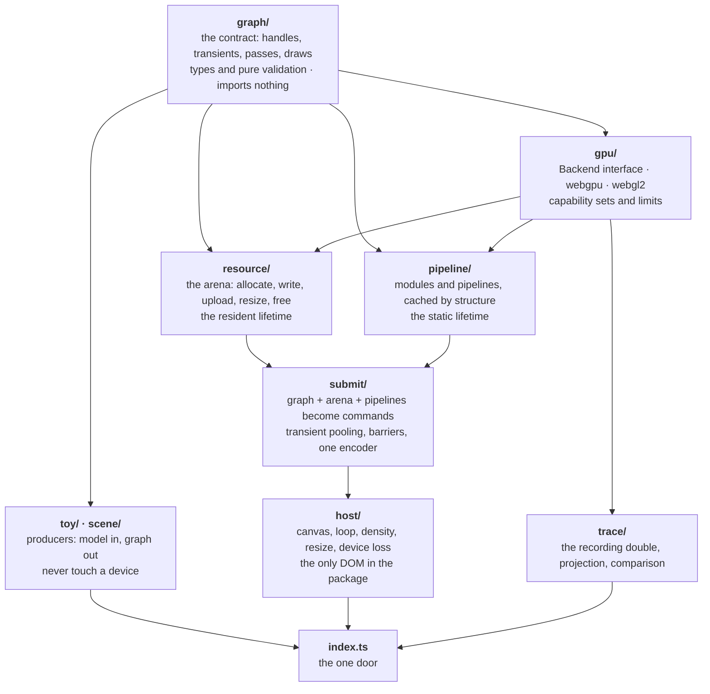

# The Road to a Pure Engine

**What this document is.** The architecture this library should have, why it does not have it yet, and the staged road from one to the other. It is written to be argued with: every claim about the present names a file, and every claim about the future names what it would cost.

**Where the decisions are.** §17 records the five architectural decisions this document rests on, each with what it commits to and what it costs. Read it first if you want the conclusions before the argument.

**What it is not.** It is not [ABSTRACTION.md](ABSTRACTION.md), which describes the stack as built for a website and still refers to files that left with that website. It is not [RENDERER-DESIGN.md](RENDERER-DESIGN.md), which owns today's type surface. Both of those documents are superseded by this one on the subject of direction; both remain accurate on the subject of what exists today, minus the stale paths noted in §3.

**The target, stated once so everything below can be measured against it.**

One package, one import path, two extremes both first class:

- **The toy tier.** A fullscreen fragment shader. A compute shader writing a storage texture that a blit shows. Hand-written source, edited and recompiled while the page runs, pixels readable back. Shadertoy and Compute Toys.
- **The scene tier.** A scene graph with transforms and cameras, meshes and materials, instancing, textures, shadow maps, post-processing, assets arriving after the page opened, thousands of objects. PlayCanvas.

WebGPU is the primary target. WebGL 2 is the fallback. Both tiers reach the card through the same door, the same types, and the same submission path.

---

## 1. The permission slip

The most important fact about this codebase is that it was not half built. It was **fully built for a different goal**, and that goal has now left the repository.

[ABSTRACTION.md](ABSTRACTION.md) states five invariants. The first is:

> **Code is 1:1 with the shader page**, in the language that shader is written in. This is permanent under D86.

That invariant is not a style preference. It is an architectural constraint with teeth: it says every line of this library is printed in an article a reader opens, which caps how large any layer may grow, and it explicitly caps the engine layer. The same document says so in as many words — "how much of it is allowed to be invisible" — and picks the strict reading.

An engine's entire value is code you do not read. The invariant and the target are opposites.

So the correct reading of the current state is not "the architecture is weak". It is **"invariant 1 was load-bearing, and it is now void."** Moving to this repository is what voids it. Everything in this document follows from that single deletion, and nothing in it was a mistake before that deletion.

Two more invariants survive intact and should be carried forward without amendment:

- **A method one backend has to throw from is the wrong method.** Capability lives in the data, never as a method a caller asks about. This is the best rule in the codebase.
- **A description is data and its producer is replaceable.** This is the seam that makes the whole road affordable.

Invariant 4, one fact one home, survives and gets extended. Invariant 5, every capability has a preset and a trace, survives and gets extended.

## 2. Why it turned out this way

Three causes, in increasing order of how much they explain.

**One: the origin.** The renderer began as a Shadertoy-class frame player. One shader, one program, one frame, drawn fullscreen. Three assumptions were reasonable then and are now load-bearing in the wrong direction:

| assumption | where it lives today | what a scene needs |
| --- | --- | --- |
| one shader is one frame is one program | cache keyed on `id` plus source text, [renderer/index.ts:125](../renderer/index.ts#L125) | many pipelines inside one frame |
| every resource is decided before frame one | `createProgram` allocates all resources up front | objects and assets appear at run time |
| one uniform block, written whole, once per frame | `setUniforms(Record<string, UniformValue>)` | per object data, thousands of records |

**Two: the growth process was sound and the substrate was the limit.** Steps 5 through 18 each landed one capability, one preset, one gate. That is a good process and it is why the code is unusually well tested for its age. But every one of those capabilities was added *inside a single lifetime* — resources and pipelines fixed before the first frame — because the site never needed any other. Feature-by-feature growth did not cause the debt. It faithfully filled out one third of a design.

**Three: the top layer was written against a hole.** `engine/` was written last, against a renderer whose frame type could not express what it produced. That is why it connects to nothing:

```
grep -rn '\.\./engine|\.\./renderer' renderer/*.ts engine/*.ts   →   no matches
```

[engine/draw-list.ts](../engine/draw-list.ts) returns `{ id, world: Mat4 }[]`. [engine/material.ts](../engine/material.ts) returns `Batch { pipeline, draws[] }`. Nothing accepts either, and no type it could return would have been accepted, because `RenderPassSpec.draw` is one draw and there is no per draw data. `batchOnePipeline` refuses a scene spanning two pipelines — a restriction documented as a scheduling choice left to the caller, but in fact the only shape the renderer could have drawn.

**And the naming records all of this.** `renderer` and `engine` are not two layers. They are two dates. `renderer/` spans the card ([renderer/webgpu.ts](../renderer/webgpu.ts)), the data contract ([renderer/types.ts](../renderer/types.ts)), source reflection, the program cache, and a DOM loop reading `window.devicePixelRatio` — simultaneously the lowest thing in the stack and the highest. `engine/` sits beside the highest thing while belonging above it.

## 3. The debt, itemized

Ordered by consequence. Each row is the thing to be deleted, not merely noted.

| # | debt | where | consequence |
| --- | --- | --- | --- |
| 1 | resources, pipelines and passes share one lifetime | `createProgram`, [renderer/webgpu.ts](../renderer/webgpu.ts) | the root cause of rows 2, 3, 5 and 9 |
| 2 | program cache key omits resources, pipelines and passes | [renderer/index.ts:125](../renderer/index.ts#L125) | two generated frames, same `id` and source, different geometry — cache hit, **silently draws the wrong resources** |
| 3 | no per draw data, no dynamic offsets, one draw per pass | `RenderPassSpec`, `ShaderProgram.setUniforms` | the scene tier is unreachable |
| 4 | `DocumentAddress` is a three-value union, and text is keyed by address | [renderer/types.ts:403](../renderer/types.ts#L403), `assembleFrame` | two distinct WGSL sources cannot coexist in one frame |
| 5 | a description is per target (`target: 'wgsl' \| 'glsl'`) | `FrameDescription` | a producer authors twice, and one graph cannot serve two backends |
| 6 | WebGL 2 accepts only one fullscreen pass | [renderer/webgl2.ts](../renderer/webgl2.ts), 8 named frame refusals | the README's "one door onto WebGL 2 and WebGPU" holds only for the toy tier |
| 7 | resources are strings resolved in maps at draw time | throughout the backend | no misuse is a compile error; a map lookup per draw per frame |
| 8 | `engine/` imports and is imported by nothing | §2 | 480 lines with no consumer, shipped under the package's own name |
| 9 | resource lifetime equals program lifetime | `createProgram` | a scene gaining one object rebuilds and recompiles everything |
| 10 | vocabulary and members from the website | table below | a reader learns the wrong model from the type names |
| 11 | `Surface` reads `window` and `clientWidth` inline | [renderer/surface.ts](../renderer/surface.ts) | the live path cannot run in a worker or headless |
| 12 | both design documents reference paths that do not exist | `lib/`, `content/`, `hooks/`, `public/shaders/build/manifest.json`, `components/ui/WgslRefusal.tsx` | the docs teach a stack that is not here |
| 13 | the audit in ABSTRACTION.md is stale | lists `writeBuffer` and `setPasses` as missing; both landed | a reader plans against solved problems |

Website vocabulary still in shipped code, 42 comment lines saying "the site", "a reader", "an episode", "the manifest", plus:

| fossil | where |
| --- | --- |
| `setArtefact`, `artefact` parameters | [renderer/surface.ts:56](../renderer/surface.ts#L56) |
| `ShaderFrame` naming a whole render graph | [renderer/types.ts:449](../renderer/types.ts#L449) |
| `WGSL_FRAGMENT_ENTRY = 'fragMain'`, `ONE_PASS = 'frame'` | [renderer/frame.ts](../renderer/frame.ts) |
| `Extent = number \| 'frame'`, `Dispatch = … \| 'frame'` | [renderer/types.ts:71](../renderer/types.ts#L71) |
| `ModuleSpec.overrides`, the phone and desktop "rungs" | [renderer/types.ts:31](../renderer/types.ts#L31) |
| `unreached()`, for one dead-uniform compiler quirk | `ShaderProgram` |
| `report()`, no consumer but a gate that prints it | [renderer/types.ts:596](../renderer/types.ts#L596) |
| `readBuffer` answering vacuously on one backend | `ShaderProgram` |
| `ShaderFrame.uniforms: { name, type }[]`, which exists to draw a control panel | [renderer/types.ts:452](../renderer/types.ts#L452) |

That last one is a user-interface concern living inside a render type. It is the clearest single example of the shape of all of row 10.

## 4. What is worth keeping, named so nobody burns it

The migration must not lose these. They are why the road is affordable at all.

- **The recording double, the trace contract, and the gates.** A fake device records every call; a real device draws the same artefact; the two traces are compared call for call. Twelve presets agree. This is rare, and it is the safety net that makes §15's surgery a refactor rather than a rewrite.
- **No capability methods.** Held consistently. Carried forward as §11.
- **A description is data.** The one seam that survives contact with the target.
- **Refusal by name.** Every one of WebGL 2's eight frame refusals says which fact it could not honour. Keep this tone everywhere.
- **Zero runtime dependencies, `sideEffects: false`, lazily imported backends.** All three correct. Keep.
- **[tests/import-graph.test.ts](../tests/import-graph.test.ts).** A test that asserts the dependency direction. It becomes the enforcement mechanism for §7.
- **Byte-exact determinism across runs and across backends.** Kept for the toy tier, where it is nearly free and catches real drift. Deliberately **not** extended to the scene tier, per §17 decision 4.

## 5. The central idea: three lifetimes

Every fact in a renderer belongs to exactly one of three lifetimes. Getting this wrong is the single mistake that produced most of §3, and getting it right is most of the architecture.

| lifetime | what belongs to it | cost | changes |
| --- | --- | --- | --- |
| **static** | shader modules, pipelines, bind group layouts, vertex formats, blend and depth state | compilation, milliseconds to seconds | when source or state changes |
| **resident** | buffers, textures, samplers, and their contents | allocation and upload | when the world changes |
| **per frame** | which passes run, which draws, which offsets, how many instances, clears, viewport | arithmetic only | every frame |

Today all three are fused inside `createProgram`. Every symptom in §3 is that fusion seen from a different angle:

- the cache key hashes source text (static) to hand back allocated resources (resident) — row 2
- geometry cannot arrive at run time, because resident is decided at static time — row 9
- per frame has nowhere to put anything, so per-draw data has no home — row 3
- a scene needs all three every frame, so no scene can attach — row 8

`setPasses` and `writeBuffer` landed already, which are the first two per-frame and resident escapes. They prove the direction. They are not the split.

**The architecture is: one module per lifetime, producers above, backends below.** Nothing else in this document is as important as that sentence.

## 6. The two tiers, in target code

Before the layers, the door. Both of these are the finished API, and neither mentions a backend, a lifetime, or a handle.

**Toy tier.**

```ts
import { createEngine, fragmentToy } from '@altpsyche/engine';

const engine = await createEngine(canvas);
const toy = fragmentToy(engine.arena, source);

engine.loop((t) => engine.submit(toy.graph({ time: t })));
```

Editing the source is `toy.recompile(next)`, which returns diagnostics or null and leaves the last good pipeline drawing. Reading pixels is `await engine.readPixels()`.

**Compute toy tier.**

```ts
import { createEngine, computeToy } from '@altpsyche/engine';

const engine = await createEngine(canvas);
const toy = computeToy(engine.arena, source, { field: { scale: 1 } });

if (!toy.runsOn(engine)) show(toy.refusal);   // "needs compute; this device has webgl2"
else engine.loop((t) => engine.submit(toy.graph({ time: t })));
```

**Scene tier.**

```ts
import { createEngine, createWorld, sceneView, box, standardMaterial, camera } from '@altpsyche/engine';

const engine = await createEngine(canvas);
const world = createWorld();
const view = sceneView(engine.arena, { shadows: true, post: ['bloom'] });

const ground = world.add({ mesh: box(engine.arena, 10, 1, 10), material: standardMaterial(engine.arena, { colour: grey }) });
world.add({ parent: ground, mesh: box(engine.arena, 1, 1, 1), material: standardMaterial(engine.arena, { colour: red }) });

const eye = camera({ fovY: Math.PI / 4, near: 0.1, far: 100 });

engine.loop((t) => {
  world.set(ground, { rotation: rotationY(t) });
  engine.submit(view.graph(world, eye));
});
```

**The point.** `fragmentToy`, `computeToy` and `sceneView` are all the same kind of thing — a **producer**, which is a function from some model to a `FrameGraph`. `engine.submit` accepts a graph and knows nothing about which producer made it. That is the whole design, and it is the same claim ABSTRACTION.md made about the build being one producer of a description. This document's contribution is making it true for a producer that runs every frame.

## 7. The layer stack

Ordered by dependency, not by conceptual height. Every module may import only modules that appear above it in this list.



The rules, each enforceable and worth enforcing in [tests/import-graph.test.ts](../tests/import-graph.test.ts):

1. **`graph/` imports nothing.** It is types plus pure functions over them. This is what makes a graph serializable, comparable, snapshot-testable and sendable to a worker.
2. **A producer never imports `gpu/` or `submit/`.** It imports `graph/` and takes an `Arena` as a parameter. Consequence: the entire scene tier is unit-testable with no device at all, and its output is a value you can diff.
3. **DOM appears in `host/` and nowhere else.** Consequence: `submit/` runs in a worker and in Node against the double.
4. **No module owns two lifetimes.** `resource/` never compiles a pipeline; `pipeline/` never allocates a buffer; `submit/` allocates nothing that outlives a frame except pooled transients.
5. **The word "engine" names the package and no folder.** Folders name what they own. This is the answer to why `renderer/engine` reads as weird: it was naming *when*, and every folder above names *what*.

## 8. The graph: the one contract

Sketched, not final. Read it for shape.

```ts
// graph/handles.ts — imports nothing
declare const Kind: unique symbol;
export type Handle<K extends string> = number & { readonly [Kind]: K };

export type BufferHandle   = Handle<'buffer'>;
export type TextureHandle  = Handle<'texture'>;
export type SamplerHandle  = Handle<'sampler'>;
export type ShaderHandle   = Handle<'shader'>;
export type PipelineHandle = Handle<'pipeline'>;
export type TransientId    = Handle<'transient'>;
```

Branded integers. Zero runtime cost, misuse is a compile error rather than a map miss at draw time, and a graph stays a plain JSON value. That is §3 row 7 deleted.

```ts
// graph/refs.ts
export type Ref<H> = { resident: H } | { transient: TransientId };
export type BufferRef  = Ref<BufferHandle>;
export type TextureRef = Ref<TextureHandle>;
```

**Two resource lifetimes, and this distinction is the one that serves both tiers with one type.**

- **Resident** is allocated through the arena and lives across frames. A mesh uploaded once and drawn for a thousand frames. The scene tier is almost entirely resident.
- **Transient** is declared inside the graph itself, by descriptor, and pooled and aliased by `submit/`. A depth buffer. A ping-pong pair for bloom. The toy tier is almost entirely transient.

```ts
export type Transient =
  | { kind: 'texture'; size: { scale: number } | { width: number; height: number };
      format: TextureFormat; usage: TextureUsage; samples?: 1 | 4; mips?: number | 'full' }
  | { kind: 'buffer'; bytes: number; usage: BufferUsage };
```

`{ scale: 1 }` replaces `Extent = number | 'frame'` — relative sizing without a magic word, and `{ scale: 0.5 }` is a half-resolution target the old type could not say.

```ts
// graph/passes.ts
export type BindEntry =
  | { slot: number; buffer: BufferRef; offset?: number; size?: number }
  | { slot: number; texture: TextureRef; view?: ViewSpec; as: 'sample' | 'storage' }
  | { slot: number; sampler: SamplerHandle };

export type BindSet = { group: number; entries: BindEntry[] };

export type Draw = {
  pipeline: PipelineHandle;
  binds: BindSet[];
  vertices?: { slot: number; buffer: BufferRef; offset?: number }[];
  index?: { buffer: BufferRef; format: 'u16' | 'u32'; offset?: number };
  count: { vertices: number } | { indices: number } | { indirect: BufferRef; offset?: number };
  instances?: number;
  /** One slice of a per-draw buffer. Dynamic offset on WebGPU,
   *  bindBufferRange on WebGL 2, the same field either way. */
  perDraw?: { buffer: BufferRef; offset: number; size: number };
};

export type RenderPass = {
  kind: 'render';
  name: string;
  colour: Attachment[];
  depth?: DepthAttachment;
  viewport?: Rect;
  /** Many. This one word is the scene tier. */
  draws: Draw[];
  timed?: { buffer: BufferRef; slot: number };
};

export type ComputePass = {
  kind: 'compute';
  name: string;
  dispatches: { pipeline: PipelineHandle; binds: BindSet[];
                groups: [number, number, number] | { indirect: BufferRef } }[];
  timed?: { buffer: BufferRef; slot: number };
};

export type CopyPass = { kind: 'copy'; from: TextureRef | BufferRef; to: TextureRef | BufferRef; region?: Region };

export type Pass = RenderPass | ComputePass | CopyPass;

export type FrameGraph = {
  label: string;
  requires: readonly Capability[];
  transients: readonly Transient[];
  passes: readonly Pass[];
  present?: TextureRef;
};
```

Four things to notice, each deleting a row of §3:

- `draws: Draw[]` rather than `draw: DrawSpec`. Row 3.
- `perDraw` on a draw. Row 3.
- **No `target` field anywhere.** A graph is language-neutral; source selection belongs to the shader handle. Row 5.
- **No strings naming resources.** Row 7.

And one thing that is deliberately absent: there is no `uniforms: { name, type }[]`. What a control panel should show is a fact about a source, answered by `reflect(source)` in the toy producer, never carried on the thing submitted to a card.

## 9. Resources: the arena

```ts
// resource/arena.ts
/** WGSL, always, and only. There is no GLSL arm: a shader is authored once,
 *  and what WebGL 2 needs is produced by translation rather than by a second
 *  hand-written source. See §9.1. */
export type ShaderSource = {
  wgsl: string;
  constants?: Record<string, number>;
  /** A translation this source has already been through, supplied by a build
   *  step so the running page does not have to do it. Absent means translate
   *  on demand, which is the editing path. */
  glsl?: { vertex: string; fragment: string };
};

export interface Arena {
  buffer(desc: BufferDesc): BufferHandle;
  write(h: BufferHandle, bytes: ArrayBufferView, at?: number): void;
  read(h: BufferHandle, range?: Range): Promise<ArrayBuffer>;

  texture(desc: TextureDesc): TextureHandle;
  upload(h: TextureHandle, from: ImageBitmap | ArrayBufferView, to?: Region): void;
  resize(h: TextureHandle, width: number, height: number): void;

  sampler(desc: SamplerDesc): SamplerHandle;

  shader(source: ShaderSource): ShaderHandle;
  pipeline(desc: RenderPipelineDesc | ComputePipelineDesc): PipelineHandle;

  free(h: Handle<string>): void;
}
```

One `ShaderSource` serving two backends is how **one graph serves two backends**. The source is WGSL; WebGL 2 receives a translation of it. Nothing above `resource/` knows which backend it is feeding, and no producer authors a shader twice. That is §3 rows 5 and 6 deleted rather than papered over.

### 9.1 Translation, and where it runs

Authoring WGSL only means something has to speak GLSL to WebGL 2. That something is a WGSL-to-GLSL translator — Naga or Tint, compiled to wasm. It is the first dependency this library has ever had, so **where it runs matters more than which one it is.**

Two paths, and the split is what keeps the shipped cost at zero:

- **Ahead of time, for anything a build can see.** Every material a producer ships with, and every preset in the corpus, is translated once by a build step and the result travels in `ShaderSource.glsl`. A scene-tier consumer on WebGL 2 downloads no translator and pays no translation cost. The build also gets to *fail* on a shader that will not translate, which is the right place to find out.
- **On demand, and only for the editing path.** Someone typing WGSL into the toy tier on a WebGL 2 device needs translation while the page runs. That is the one case that fetches the wasm translator, by `await import()`, in its own chunk, exactly the way a backend is fetched today.

Three consequences, stated so they are not discovered later:

1. **Translation is a correctness surface, so it gets a gate.** Every corpus preset draws on both backends and the frames are compared. A translator bug then shows up as a red gate naming the preset, which is the same shape as every other proof in §12.
2. **Some WGSL will not translate**, and it should be refused by name at build time with the construct named. This is a capability refusal in a different coat, and it belongs in the same vocabulary as §10.
3. **The translator never appears in `graph/`, `submit/` or any producer.** It sits inside `resource/` behind `shader()`, or in the build. Invariant 4 holds: exactly one place turns a source into something a backend can compile.

Three properties the arena must have that today's resource handling does not:

- **A handle is stable and reused.** `free` returns it to a free list with a bumped generation, so a use-after-free is detectable rather than a silent wrong texture.
- **Uploads are queued, not immediate.** Ordered against the frame that reads them; the current `build()` on resize is unsequenced against a queued draw, and the double cannot see it.
- **`pipeline()` is content-addressed.** Keyed on the whole *structure* — source text, entry points, formats, blend, depth, vertex layout — not on an id. Two calls with the same structure return the same handle. That is §3 row 2 deleted at the root, because the key now contains everything the result depends on.

## 10. Capability, not methods

Carry the best existing rule forward and give it a type.

```ts
// graph/capability.ts
export type Capability =
  | 'compute' | 'storage-buffer' | 'storage-texture'
  | 'indirect' | 'timestamp' | 'occlusion'
  | 'msaa' | 'float-blend' | 'depth-clamp' | 'bgra-storage';
```

A graph declares `requires`. A device reports `capabilities`. Selection and refusal are one pure function:

```ts
export function refusal(graph: FrameGraph, device: { backend: BackendName; capabilities: ReadonlySet<Capability> }): string | null;
// → `the graph "particles" needs compute and storage-buffer; webgl2 has neither`
```

No backend ever grows a method it must throw from. No caller ever branches on which backend it holds. A producer that wants to degrade gracefully offers two graphs and asks which is accepted — which is a producer's choice, made with knowledge the library does not have, and exactly the argument `batchOnePipeline` already makes about pipeline ordering.

**And now the honest answer about WebGL 2**, which is the opposite of today's.

WebGL 2 **cannot** do: compute, storage buffers, storage textures, indirect draw or dispatch, timestamp queries, bindless. WebGL 2 **can** do: multiple passes, up to eight colour attachments, depth and stencil, instanced draws, uniform buffer ranges per draw, float textures, MSAA resolve, mipmap generation.

Read that list against §6. **WebGL 2 can run the scene tier. It cannot run the compute toy tier.** Today's backend runs only the toy tier and refuses everything above it — precisely inverted, because it was written when the toy tier was all there was.

So the fallback target is: `sceneView` produces a graph that runs on both, with the compute-dependent options (`post: ['bloom']` via compute, GPU culling, particle simulation) declaring capabilities and degrading to a raster path or being refused by name. `computeToy` declares `compute` and is refused with a message a page can print.

This is a decision rather than a discovery, and §17 says how to reverse it.

## 11. The single door

Unchanged in policy, corrected in mechanism.

```ts
// index.ts
export * from './graph/index.js';        // types, validation, capability
export * from './resource/index.js';     // Arena
export * from './host/index.js';         // createEngine, loop
export * from './toy/index.js';          // fragmentToy, computeToy, reflect
export * from './scene/index.js';        // createWorld, sceneView, camera, meshes, materials
export * from './trace/index.js';        // the double
// backends are never re-exported; they are await import()ed inside gpu/select.ts
```

Two mechanisms doing two different jobs, which the current README conflates into one:

- **Backends are dynamically imported** because the choice is made at run time from what the browser has. A browser with no WebGPU must never download the WebGPU backend. This is why `createEngine` is async, and it is the right reason.
- **Producers are statically exported and tree-shaken.** `sideEffects: false` plus ESM means a consumer importing only `fragmentToy` does not ship `scene/`. No dynamic import needed, no async cost, no subpath.
- **The WGSL-to-GLSL translator is dynamically imported too**, and only on the editing path on a WebGL 2 device, per §9.1. It is never re-exported and never named by a consumer. A shipped scene carries translations made by its build, so the common case downloads nothing.

Which keeps the promise the package has held since the start: **zero runtime dependencies for anything a consumer ships.** The translator is a build tool that happens to also be loadable at run time for the one case that needs it.

State both in the README. Today it explains the first and implies the second is impossible.

## 12. What holds it

Five mechanisms. Two exist and are strong; three are new and cheap, and are only possible because of §7 rule 2.

**Existing, keep.**

1. **The trace contract.** Fake device and real device draw the same graph; traces compared call for call. Extend the corpus with one preset per capability, as today.
2. **Byte-exact frame comparison**, across runs and across backends, **for the toy tier and the corpus presets only.** Per §17 decision 4, scenes are held by the trace contract and by golden graphs instead. Saying where the guarantee stops is what keeps it worth having where it holds.

**New, and each is a direct dividend of a pure `graph/`.**

3. **`validate(graph): Diagnostic[]`, a pure function.** Every rule that is today checked in two wordings — [renderer/frame-rules.ts](../renderer/frame-rules.ts) exists precisely because two places needed the same rule — is checked here once. Runs in tests, in dev builds, and in any offline producer. This is where invariant 4, one fact one home, gets its enforcement.
4. **Golden graphs.** A producer's output is a JSON value. Snapshot it. A change to `sceneView` shows up as a diff in a text file, with no GPU, no browser, and no picture to squint at. This is the single largest maintainability win available, and it is impossible today because no producer output is a value.
5. **Handle liveness in the double.** ABSTRACTION.md's audit notes that the double models calls rather than lifetimes, so use-after-free and leaks are invisible to the fast suite. With generational handles the double can track liveness, and both become test failures rather than production mysteries.

Extend the one-fact-one-home ledger with the new rows:

| the fact | its one home |
| --- | --- |
| what a shader draws | the source text |
| where each uniform sits | `reflect()` in `toy/`, or the material's own layout in `scene/` |
| how big a resource is | the arena descriptor that allocated it |
| how big a transient is | its descriptor in the graph |
| which capability a graph needs | `graph.requires` |
| which capabilities a device has | `device.capabilities` |
| whether a graph may run here | `refusal(graph, device)`, nowhere else |
| every rule a graph must satisfy | `validate(graph)`, never also in a backend |
| the bytes of generated geometry, and their stride | the function that generated them |

## 13. Extendability, proved

The measure of an architecture is what a feature touches. Six features, and the count is the argument.

| feature | touches | new backend code |
| --- | --- | --- |
| shadow maps | `scene/`: one transient depth texture, one extra render pass, a light matrix | none |
| bloom, or any post chain | `scene/` or a `post/` producer: N transients, N passes | none |
| GPU particles | a producer: resident storage buffer, one compute pass, `requires: ['compute','storage-buffer']` | none |
| frustum and occlusion culling | `scene/`: fewer entries in `draws[]` | none |
| indirect draw | `graph/`: one `count` variant, one capability; one branch per backend | two branches |
| a third backend | `gpu/`: one `Backend` implementation | one file |

Four of six touch a producer only. That is the property to protect, and §7 rule 2 is what protects it: a producer that cannot reach a device cannot be tempted to.

Three further things the graph-as-data shape gives away free, none of them designed for:

- **Record and replay.** A graph is JSON. Capture a frame, replay it in a test.
- **Worker submission.** `submit/` has no DOM. Producers have no DOM. Move both off the main thread when it matters.
- **An offline producer.** A build step can still emit a graph and ship it as data, which is exactly what the website did. That path is not lost; it becomes one producer among several, which is what ABSTRACTION.md always claimed and could not quite deliver.

## 14. Vocabulary

Renames, all mechanical, all worth doing before the consumer count grows past one.

| today | tomorrow | why |
| --- | --- | --- |
| `ShaderFrame` | `FrameGraph` | it is a render graph; the old name is the fossil that makes `scene/` read as a bolted-on sibling |
| `FrameDescription` | folded into `FrameGraph` | there is one graph, with resident handles and transient descriptors, not a pre- and post-fetch pair |
| `ShaderProgram` | deleted | it was three lifetimes in a trench coat; becomes `Arena` + pipeline cache + `submit` |
| `setArtefact` | `setGraph`, or just `submit` | |
| `artefact` | `graph`, or `variant` where a quality level is meant | |
| `ModuleSpec.overrides`, "rungs" | `ShaderSource.constants`, plus a `quality` argument on a producer | a rung was a phone and a desktop; a constant is what WebGPU calls it |
| `Extent = number \| 'frame'` | `{ scale: number } \| { width, height }` | says half-resolution, which the old type could not |
| `Dispatch = … \| 'frame'` | `groups: [n,n,n] \| { indirect }` | a producer computes the count from the size it knows |
| `unreached()` | `reflect(source).unused`, dev-only, in `toy/` | a compiler quirk is a diagnostic, not a device method |
| `report()` | `engine.capabilities` and `engine.limits` | a set and a record, both consumed by §10 |
| `readBuffer` answering vacuously | gone | with capabilities, a backend without buffers never receives a graph that reads one |
| `ShaderFrame.uniforms` | gone from the graph; `reflect()` in `toy/` | a control panel is not a render fact |
| `renderer/`, `engine/` | the folders in §7 | they named *when*, not *what* |

## 15. The road

Seven stages. Every one ships, every one has an exit criterion, and none is a rewrite. The trace contract is the net under all of them: **at every stage, the existing gates must pass unchanged.** Where a stage cannot keep them passing without editing a gate, that is the signal that the stage is doing two things.

### Stage 0 — stop the bleeding

Days. No architecture.

- Fix the cache key: include a structural hash of resources, pipelines and passes, or take the key from the caller. **§3 row 2 is a silent wrong picture and it is one function.**
- `DocumentAddress` becomes `string`; key fetched text by document name, not by address.
- README: state that WebGL 2 covers the toy tier only, today.
- Both design documents: delete the paths that do not exist, inline what each `Dnnn` settled, mark the stale audit rows solved.

*Exit:* no known silent-wrong-output path; no document naming a file outside this repository.

### Stage 1 — the split

The one piece of real surgery, and it is the stage that matters. Take `createProgram` apart along §5's three lifetimes:

- `resource/` gets allocation, upload, resize, free — with handles, generations and a queued upload path.
- `pipeline/` gets module compilation and a structurally-keyed pipeline cache.
- `submit/` takes a graph plus those two and produces commands.

**Add no features.** The existing `FrameDescription` keeps working, translated to the new path at the seam. Every existing test and gate passes untouched.

*Exit:* `createProgram` is gone; the twelve trace presets still agree; not one gate edited.

### Stage 2 — handles, transients, validation

- String resource names become handles throughout; `Ref` gains its resident and transient arms.
- `submit/` pools and aliases transients.
- `validate(graph)` absorbs every rule currently written twice, [renderer/frame-rules.ts](../renderer/frame-rules.ts) included.
- The double starts tracking handle liveness.

*Exit:* no resource resolved by string at draw time; one home per rule; a use-after-free fails a test.

### Stage 3 — per draw, and many draws

- `RenderPass.draws` becomes a list.
- `Draw.perDraw` lands: dynamic offsets on WebGPU, `bindBufferRange` on WebGL 2.
- Instancing lands beside it.

*Exit:* one preset draws a thousand cubes, each with its own transform, on both backends, in one pass.

### Stage 4 — the scene becomes a producer

- `sceneView(arena, options).graph(world, camera) → FrameGraph`. §3 row 8 closes.
- `batchOnePipeline`'s one-pipeline restriction is deleted, because the reason for it is gone.
- Golden graph snapshots land for every scene preset.
- **The folders move here**, not earlier. Stage 4 is when you know what each one owns; renaming before it is guessing.

*Exit:* the §6 scene example runs; a scene change is reviewable as a graph diff.

### Stage 5 — WebGL 2 becomes a real backend

Two halves, and they are separable: do the translator first, because the backend is worth nothing without shaders to feed it.

**5a, translation.** The WGSL-to-GLSL step of §9.1: the build-time path, the on-demand wasm chunk for the editing path, refusal by named construct for what will not translate, and a both-backends frame comparison on every corpus preset.

**5b, the backend.** Multi-pass, MRT, depth, stencil, instancing, per-draw UBO ranges, mip generation. Capability declaration and named refusal per §10.

*Exit:* every corpus preset draws byte-identically on both backends from one WGSL source; the same scene graph draws on both; a compute graph is refused by name with a message a page can show.

### Stage 6 — the engine, as producers

Shadows, post chain, culling, asset loading, GPU particles. Each is one producer, one preset, one gate — the same process as steps 5 through 18, now on a substrate with room for it.

*Exit:* whatever the first real consumer needs, and nothing beyond it.

## 16. The new five invariants

Replacing ABSTRACTION.md's, which were correct for a website.

1. **A graph is data, imports nothing, and every producer is replaceable.** The moment something can only be produced at build time or only at run time, the seam is gone.
2. **A method one backend has to throw from is the wrong method.** Capability lives in `graph.requires` and `device.capabilities`. Unchanged, and still the best rule here.
3. **No module owns two lifetimes.** Static, resident and per frame have three homes and never fewer.
4. **A producer cannot reach a device.** It imports `graph/` and receives an `Arena`. This is what makes the engine testable without a GPU and extendable without touching a backend.
5. **One fact, one home, and a disagreement fails a test rather than reaching the card.** Per the §12 ledger, enforced by `validate`.

Invariant 1 of the old five — code 1:1 with a shader page — is retired, per §1. That retirement is what this entire document spends.

## 17. Decisions, settled 2026-08-24

Every question this document opened has an answer. Recorded here with what each one commits to and what it costs, so a later reader argues with the decision rather than re-deriving it.

| # | question | decision | what it commits to |
| --- | --- | --- | --- |
| 1 | how far does the WebGL 2 fallback go | **the scene tier, reduced** | Stage 5 stays. Every scene feature needs either a raster path or a declared capability. Compute-tier graphs are refused by name. Two real backend implementations, which is the number that keeps the interface honest. |
| 2 | where does shader source come from | **WGSL only, translated to GLSL** | No material is ever authored twice. Adds the first dependency, scoped by §9.1 so nothing a consumer ships carries it. Translation becomes a gated correctness surface. |
| 3 | one package or two | **one package, one door** | `@altpsyche/engine` holds graph, backends, toy tier and scene tier. `sideEffects: false` keeps a toy consumer from shipping `scene/`. The docs carry the strain of two audiences. |
| 4 | how far does byte-exact determinism go | **toy tier and corpus presets only** | Kept where it is nearly free. Scenes are held by the trace contract and golden graphs instead. The guarantee's edge is stated rather than implied. |
| 5 | where does the asset pipeline live | **outside this library** | The arena takes `ImageBitmap`, `ArrayBuffer` and typed arrays. glTF parsing, KTX2 and Basis transcoding, and mesh optimisation are a consumer's business. Runtime dependencies stay at zero and the door stays small. |

### What decisions 1 and 2 do together

They are the pair that shapes the most work, and they pull in useful opposite directions.

Decision 1 says WebGL 2 matters enough to run real scenes. Decision 2 says nobody pays for that in authoring effort. Together they push all of the cost into **one** place — the translator — where it can be gated, cached, and made a build-time failure rather than a run-time surprise. That is the right place for a cost to live: a single seam with a test around it.

The residual risk is honest and worth naming: **the translator is now on the critical path for the entire WebGL 2 story.** If it cannot handle something the scene tier needs, decision 1 degrades toward "toy tier only" by construction rather than by choice. Which is why Stage 5a comes before 5b, and why its exit criterion is every corpus preset drawing byte-identically from one source. Find that wall early, while turning back is still cheap.

### What decisions 3, 4 and 5 protect

All three protect the same thing from different sides: **the door stays small and the package stays dependency-free for anything shipped.** One package with tree-shaking, a determinism guarantee that stops where it stops being cheap, and an asset story that lives elsewhere. Each is a refusal to grow the surface faster than the proof machinery can cover it — which is invariant 5 of §16 applied to the library rather than to a capability.

### Still genuinely open

Not questions this document can answer, and not blockers for any stage:

1. **What the first real consumer is.** Stage 6 says "whatever the first real consumer needs, and nothing beyond it", and that consumer does not exist yet. Until it does, Stage 6 has no contents and should not be given any.
2. **Which translator.** Naga and Tint are both wasm-compilable and both plausible. It is a Stage 5a evaluation against the corpus, not an architecture decision — §9.1 holds whichever wins.
3. **Whether `scene/` needs its own README inside one package.** Decision 3 puts the strain on the docs; if it shows, the answer is another document rather than another package.
